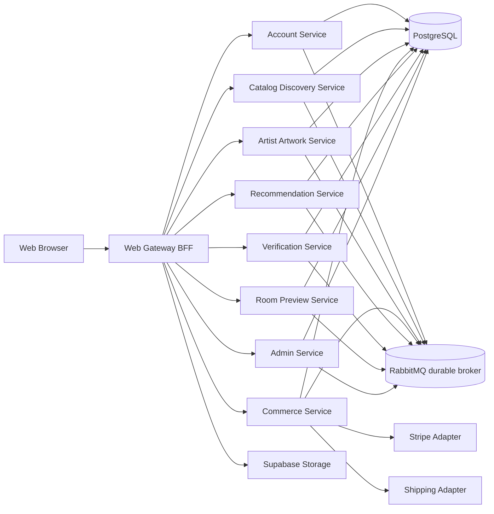
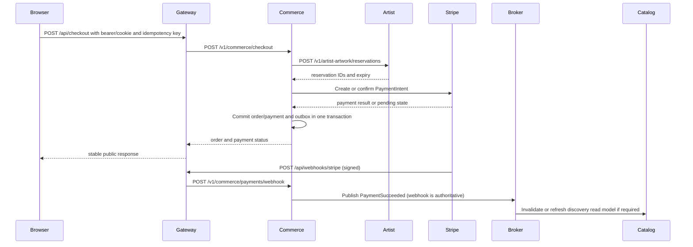
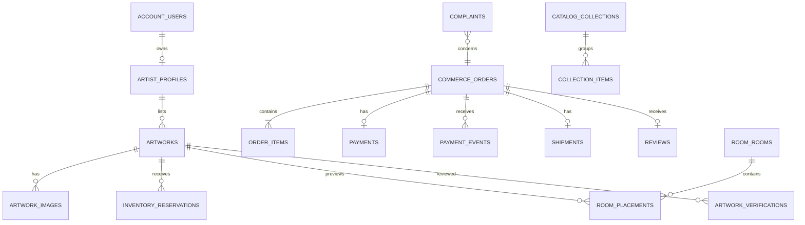
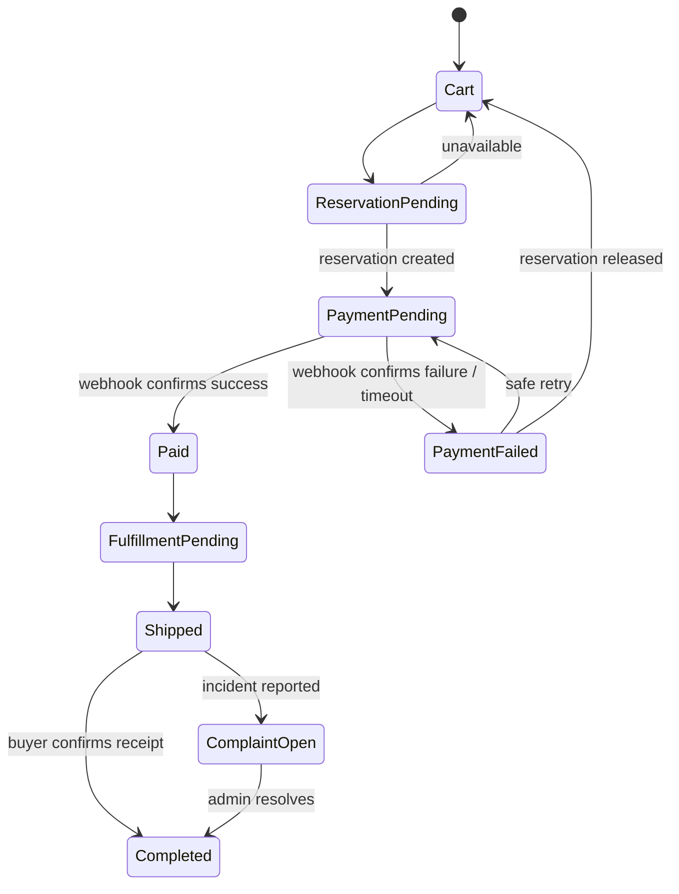

# Atelier — Plan to Reach 100% MVP Microservice Completeness

Status: evidence-audited execution document (2026-09-08, current working tree)
Execution status: **0 of 9 phases fully accepted against all exit gates. Phases 0–1 are substantially implemented but require closure; Phases 2–8 are partial, with existing foundations to reuse.** This supersedes the earlier “Phases 0 and 1 completed” claim. See §14 audit matrix for evidence and remaining gates.
Scope: complete the MVP as a real, testable, service-oriented system
Out of scope: post-MVP product expansion such as auctions, negotiation, custom commissions, social features, advanced AR, 3D galleries, and AI-generated provenance
Baseline reviewed: 2026-09-08, verified against commit `9c1d9b8` (main)
This revision replaces the 2026-09-06 edition: stale baseline claims were corrected against the working tree, verified gaps from a full repository audit were merged, and the Agent Runtime Registry Protocol (§2) was added.

## 0. Agent instructions (read first)

Every agent executing any part of this plan is bound by two standing rules:

1. **Evidence rule.** Nothing in this plan is "done" because a type export, mock response, passing build, or declared event type exists. A claim is done only when the code, migration, test, runtime behavior, and CI evidence all exist and are named in the completion report.
2. **Registry rule (§2).** Any runtime fact an agent discovers or changes — port, host, URL, environment variable name, secret name, credential location, timeout, retry policy, provider, broker topology, schema location — must be written into the canonical registries **in the same commit** that introduces or changes it. A runtime decision that exists only in code or only in an agent's session memory is treated as not made.

For implemented-state claims, source and runtime evidence determine what exists; they do not override the user's request or PROJECT_PROMPT.md product requirements. Record discrepancies in the Runtime Discovery Log (§2.5), and correct the affected plan/registry entries in the same change. This audit changes documentation only: no API, event, schema, dependency, port, or integration is adopted or changed.

## 1. Purpose and definition of "100%"

This document is the implementation plan for taking Atelier from its current partial migration to a complete MVP microservice system. "100%" means that every MVP business capability has a clear owner, durable persistence, versioned API contract, authorization, operational boundary, failure behavior, and automated verification.

It does not mean that every future product idea is implemented. The MVP remains the product boundary defined by [`PROJECT_PROMPT.md`](./PROJECT_PROMPT.md):

`discover by taste/space → inspect artwork and artist → evaluate trust → preview in a room → save or buy → checkout → track delivery`

The completion target is therefore:

- eight actual internal HTTP services, not only workspace packages;
- one public Next.js Gateway/BFF; the browser never calls an internal service;
- service-owned persistence with no cross-service table reads or writes;
- Supabase authentication (including **registration**), server-side identity checks, and role enforcement;
- fixed-price original/limited-edition commerce with safe inventory transitions;
- real payment and shipping adapter boundaries, with test adapters for local development, and an **authoritative Stripe webhook**;
- artist **image uploads** to object storage, not URL pasting, as the primary artwork image path;
- versioned REST contracts and reliable asynchronous domain events;
- timeouts, retry rules, idempotency, correlation IDs, structured errors, logs, metrics, and readiness checks;
- migrations, seed data, contract tests, integration tests, and critical-flow E2E tests;
- a repeatable local Compose environment and CI quality gates;
- a hardened Compose/deployment configuration with no plaintext dev credentials and no token fallbacks;
- runbooks that actually exist and are referenced by CI and `.env.example`.

## 2. Agent Runtime Registry Protocol

This section is the binding process for how runtime information enters and stays in the repository. It exists because the audit that produced this plan found runtime facts that were implemented in code but never registered (see §3.3 items G-18, G-19), and CI/env files referencing documentation that does not exist (G-11).

### 2.1 Standing rule

> **When an agent learns or changes a runtime fact, it writes the fact down in the same commit.**

Runtime facts are not decisions to "document later". If a change is merged and the registry entries below are not updated, the change is incomplete and must not pass review.

### 2.2 Trigger events — write to the registries when any of these happens

An agent MUST update the registries (§2.3) when it:

1. adds, removes, or changes a service port or host-port mapping (including Compose overrides such as `.docker-compose.run.yml`);
2. adds, removes, or changes any environment variable name, default, or scope (service, gateway, build-time, browser);
3. introduces or changes a secret **name** or the location where a secret **value** lives (`.env`, VPS environment file, Stripe dashboard, Supabase dashboard, secret manager);
4. adds, removes, or changes a service URL, Compose DNS name, or internal endpoint path used service-to-service;
5. changes a timeout, retry count, backoff, pool size, batch size, poll interval, or other tunable that another developer would need to reproduce the environment;
6. adopts or changes an external provider or integration (payment, shipping, storage, email, broker) — including provider mode (`test` vs `live`);
7. adds or changes a database schema, table, migration file, role, or RLS policy;
8. adds or changes an event name, exchange, queue, routing key, or dead-letter path;
9. adds or changes a health/readiness endpoint, metrics endpoint, or log field contract;
10. discovers, during execution, that this plan, `PROJECT_PROMPT.md`, `AGENTS.md`, `.env.example`, or `docker-compose.yml` states a runtime fact that the working tree contradicts.

### 2.3 Canonical update targets

For every trigger in §2.2, the agent updates, in the same commit:

| Target | What to write | Section |
| --- | --- | --- |
| `PROJECT_PROMPT.md` | The canonical runtime configuration and service-connection registry: owning service, public route, internal URL/port, authentication, timeout/retry behavior, event/schema impact | §6.1 |
| `AGENTS.md` | The runtime ports and connection variables table plus any shared-variable notes | "Runtime ports and connection variables" |
| `.env.example` | Every new/changed variable with a safe placeholder or empty value and a comment stating scope and who may read it | whole file |
| `docker-compose.yml` (and any override) | `environment:` entries, `ports:`, health checks, and `${VAR:?required}` interpolations | whole file |
| This plan (`MICROSERVICE_100_PLAN.md`) | §5 registry status flip (`planned` → `current`) and a new append-only entry in §2.5 | §2.5, §5 |
| `packages/contracts` | Any new/changed route, event, or error contract the fact belongs to | `src/index.ts`, `src/v1.ts`, `src/events.ts` |
| Service health/readiness code | If the fact is a new dependency, `/ready` must start checking it | `services/*/src/health.ts`, `server.ts` |

If the agent cannot update one of these targets (e.g., a merge conflict or unclear owner), it must state the gap explicitly in the PR description — silence is not allowed.

### 2.4 Secret handling rules

- **Names are tracked; values are never tracked.** Registry files record the variable name, scope, and where the value lives. The value itself goes only into untracked `.env`/deployment secrets.
- Never write a real token, password, API key, connection string with credentials, or personal data into any tracked file, including this plan, ADRs, PR descriptions, or the discovery log. Reference values as `<redacted — see .env>`.
- Compose must interpolate secrets with a required-variable form (`${STRIPE_SECRET_KEY:?required}`), never with a working default (`:-dev-only-internal-token`). The existing fallbacks are listed as gap G-18 and removed in Phase 0/Phase 8.
- Demo/dev credential values that must exist for Compose bootstrap (e.g., a local PostgreSQL password) are allowed **only** as explicitly labeled dev-only values in the dev override file, never in the base file, and never reused outside `docker compose` local development.
- `TAI_KHOAN_TEST.txt` (test accounts at repo root) must be either deleted or reduced to clearly-labeled demo seed accounts that exist only in seed migrations, not as a credentials file in the repository root (G-20).
- Logs, error responses, and the discovery log must never contain secret values, authorization headers, cookies, or full personal data (see §9.2).

### 2.5 Runtime discovery log (append-only)

Agents append rows here the moment they discover or change a runtime fact. Newest entries last. Each row: date, commit, fact, source (where it was learned), and registries updated.

Template:

```text
| YYYY-MM-DD | <commit> | <fact — variable, value/name, scope, owner> | <where discovered> | <files updated> |
```

Initial entries (verified 2026-09-08 against `9c1d9b8`):

| Date | Commit | Fact | Source | Registries updated |
| --- | --- | --- | --- | --- |
| 2026-09-08 | 9c1d9b8 | Gateway on `3000`; eight services on `4101`–`4108`; Postgres `5432`; RabbitMQ `5672`/`15672` — all published to host in base `docker-compose.yml` | `docker-compose.yml:8,27,49–237` | this plan §5 |
| 2026-09-08 | 9c1d9b8 | `EVENT_BROKER_URL` (`amqp://atelier_events:…@message-broker:5672`) and `EVENT_EXCHANGE=atelier.events.v1` are **current** in Compose for catalog-discovery and artist-artwork only | `docker-compose.yml:70–71,94–95` | this plan §5 (status flip from planned) |
| 2026-09-08 | 9c1d9b8 | `WEB_GATEWAY_URL` is a **current** variable (`.env.example`, compose line 120) and was missing from the plan's variable table | `.env.example` | this plan §5 |
| 2026-09-08 | 9c1d9b8 | `ATELIER_INTERNAL_SERVICE_TOKEN` falls back to `dev-only-internal-token` in Compose on all 8 services + gateway — must be removed (hardening) | `docker-compose.yml:48…236` | this plan §3.3 G-18 |
| 2026-09-08 | 9c1d9b8 | Compose inlines dev credentials: `POSTGRES_PASSWORD: atelier_local_dev` (line 7), `RABBITMQ_DEFAULT_PASS: atelier_events_dev_pw` (line 26), per-service `*_dev_pw` URLs | `docker-compose.yml` | this plan §3.3 G-18 |
| 2026-09-08 | 9c1d9b8 | `.env.example` documents the build-args mechanism for `NEXT_PUBLIC_*` (inlined at build time via `infra/Dockerfile.gateway`) | `.env.example` header | this plan §5 |
| 2026-09-08 | 9c1d9b8 | `.env.example` references `runbooks/stripe-integration.md`; `ci.yml:104` references `runbooks/deployment.md` — **neither runbook exists** (no `runbooks/` directory) | `.env.example`, `.github/workflows/ci.yml` | this plan §3.3 G-11 |
| 2026-09-08 | 9c1d9b8 | Stripe payment is confirmed by redirect-poll from the success page; no webhook is implemented | `.env.example` comment, `services/commerce-service/src/infrastructure/stripe-client.ts:20` | this plan §3.3 G-04 |
| 2026-09-08 | 9c1d9b8 | `.docker-compose.run.yml` maps host `14106` → verification container `4106`; host-side only, internal URLs unchanged | AGENTS.md registry | this plan §5 |
| 2026-09-08 | 9c1d9b8 | Only artist-artwork runs the outbox publisher (`server.ts:90`) and only catalog-discovery consumes events (`server.ts:86`) | `services/*/src/server.ts` | this plan §7 |
| 2026-09-08 | 9c1d9b8 | CI exists: validate job (type-check, lint, contract tests), compose-smoke job (config, build, Trivy 0.74.0 report-only, health wait, smoke test), manual self-hosted deploy job | `.github/workflows/ci.yml` | this plan §12.3 |
| 2026-09-08 | 9c1d9b8 | `pnpm type-check` passes across all 13 workspace packages — the old TS5097 claim is stale (§3.2 confirmed) | execution run, 2026-09-08 | this plan §3.2 |
| 2026-09-08 | 9c1d9b8 | Verification does NOT write `artist_artwork.*` — `verification-repository.ts` PATCHes artist-artwork over HTTP and inserts only into `verification.*` tables (G-22 item stale) | `services/verification-service/src/infrastructure/verification-repository.ts:13-42` | this plan §3.3 G-22 |
| 2026-09-08 | 9c1d9b8 | Commerce does NOT query `account.users`; it uses the durable reservation contract (`/v1/artist-artwork/reservations` reserve/commit/release) with `reservationIds` persisted in `commerce.checkout_sessions` (G-22 items stale; sequential per-item reserve loop remains) | `services/commerce-service/src/server.ts:24-149` | this plan §3.3 G-22 |
| 2026-09-08 | 9c1d9b8 | New `commerce.payments` rows persist `provider = 'stripe'` (the `atelier-mvp` claim is stale for new rows) | `services/commerce-service/src/infrastructure/commerce-repository.ts:55-56` | this plan §3.3 G-22 |
| 2026-09-08 | 9c1d9b8 | `simulateFailure` exists in the production checkout request schema (`CheckoutRequestSchema`) and is honored in `application/checkout.ts` (G-22 confirmed) | `packages/contracts/src/v1.ts:40`, `services/commerce-service/src/application/checkout.ts:13,23` | this plan §3.3 G-22 |
| 2026-09-08 | 9c1d9b8 | `apps/web-gateway/src/lib/server/store.ts` and `src/lib/store/db.ts` no longer exist — G-21 is already resolved; no legacy demo adapters remain in the tree | `glob apps/web-gateway/src/lib/**` | this plan §3.3 G-21 |
| 2026-09-08 | 9c1d9b8 | Demo/seed imagery policy (ADR 0001 D7): deterministic local JPEGs under `apps/web-gateway/public/img/` replace runtime picsum imagery; migration 0011 retains a narrow idempotent picsum→local compatibility rewrite for legacy rows; production swaps local paths for CDN/Storage URLs via data, not code | this plan Phase 1/Phase 3 execution | ADR 0001, this plan §2.5 |
| 2026-09-08 | working tree | `ATELIER_INTERNAL_SERVICE_TOKEN` Compose fallback `:-dev-only-internal-token` removed on all 9 processes → `${ATELIER_INTERNAL_SERVICE_TOKEN:?required}` (fail-closed); compose-smoke job env already provides the token (G-18 resolved early from Phase 8) | `docker-compose.yml:48…236`, `.github/workflows/ci.yml` | PROJECT_PROMPT.md §6.1, AGENTS.md, this plan §3.3 G-18, §2.5 |
| 2026-09-08 | working tree | New `supabase/migrations/0011_catalog_collections.sql`: `catalog_discovery.collections` + `collection_items` (RLS-forced to `catalog_discovery_service`), curated demo seed, idempotent picsum→local-asset rewrite; collections served at `GET /v1/catalog/collections` (G-17) | migration file, `catalog-discovery-service/src/server.ts`, `collections-repository.ts` | PROJECT_PROMPT.md §6.1 (route), this plan §6.3, §8.2 |
| 2026-09-08 | working tree | Registration added: `POST /api/auth/signup` (Supabase `signUp` + `users/sync`, role metadata buyer/artist, 8-char minimum password) + `/signup` UI (G-06) | `apps/web-gateway/src/app/api/auth/signup/route.ts`, `signup/page.tsx`, `SignupForm.tsx` | this plan §6.3, §9.1 |
| 2026-09-08 | working tree | Dead mock auth deleted: account-service `users`/`authenticate`/`findAccount` + `infrastructure/users.ts`/`application/account.ts`/`domain/account-rules.ts`; recommendation-service mock `follows`/`savedArtworks` export; contracts `MockUser` replaced by `AccountProfile` (G-14, G-15) | service files, `packages/contracts/src/index.ts` | this plan §3.3 G-14/G-15, §2.5 |
| 2026-09-08 | working tree | Gateway no longer imports `@atelier/*-service` or `@/data` anywhere; service constants duplicated locally in `lib/gateway/services.ts`; fixture `src/data/` deleted; `next.config.ts` transpilePackages reduced to `@atelier/config` + `@atelier/contracts` (G-01, G-02, G-21 follow-through) | `next.config.ts`, `lib/gateway/services.ts` | ADR 0001 D1, this plan §3.3 |
| 2026-09-08 | audit of working tree | `SERVICE_REQUEST_TIMEOUT_MS` is already read by the shared internal client (default 3000 ms); it is not merely planned. Canonical registry/env/Compose reconciliation remains open. | `packages/config/src/service-client.ts` | this plan §5/§14; other registries unresolved, no runtime change in this audit |
| 2026-09-08 | audit of working tree | `ATELIER_ALLOW_INSECURE_LOCAL=true` permits tokenless startup outside NODE_ENV=test; constrain/remove or document the bypass during Phase 2, rather than claiming unconditional fail-closed startup. | `packages/config/src/http.ts#assertInternalTokenConfigured` | this plan §14; canonical registry/security decision remains open |
| 2026-09-08 | audit of working tree | All five runbooks exist locally but are ignored by `*.md`; the backup script additionally references a differently named missing runbook. Local existence is not clean-checkout CI evidence. | `.gitignore`, `runbooks/`, `scripts/backup-db.sh`, `.github/workflows/ci.yml` | this plan §14/Phase 8 |
| 2026-09-08 | audit of working tree | Existing Compose containers report healthy; their images predate this audit and include a local override. Config validates with a temporary placeholder, but current-tree business flows were not verified. | read-only `docker compose config --quiet` and `docker compose ps` | this plan §14; ports/credentials unchanged |


## 3. Evidence-based baseline (verified at `9c1d9b8`, 2026-09-08)

### 3.1 Historical baseline at 9c1d9b8 (current audit status: §14)

| Current evidence | Interpretation |
| --- | --- |
| Eight service packages under `services/*`, each with `src/server.ts`, `health.ts`, application/domain/infrastructure layers | The intended service topology exists in code. |
| `docker-compose.yml` defines PostgreSQL, RabbitMQ (`message-broker`), Gateway, and eight service containers | A local deployment shape exists. |
| `packages/persistence/src/index.ts` exposes a PostgreSQL pool and transaction helper | Durable persistence primitives exist. |
| `supabase/migrations/0001…0010` define service schemas, business tables, RLS + roles (0006), event outbox + dedup (0007), inventory reservations (0008), checkout idempotency (0009), Stripe checkout sessions (0010) | The target data model is substantially represented in SQL. |
| `packages/events/src/` implements `runOutboxPublisher` (`outbox.ts:91`), broker helpers (`broker.ts`), and a consumer; artist-artwork starts the publisher (`server.ts:90`) and catalog-discovery consumes (`server.ts:86`) | Event delivery exists for one producer→consumer path; it is not architecture-wide. |
| Gateway clients use HTTP with timeouts, correlation IDs, and `x-service-token` (`apps/web-gateway/src/lib/gateway/`) | The Gateway transport seam exists. |
| `api/auth/login/route.ts:16` uses Supabase `signInWithPassword` and syncs the profile to Account (`/v1/account/users/sync`) | Gateway authentication is Supabase-backed; mock-user auth in Account is dead code (G-14). |
| `services/commerce-service/src/infrastructure/stripe-client.ts` creates Stripe Checkout Sessions | A real payment provider adapter exists for session creation; webhooks do not exist (G-04). |
| Room preview has rooms, buyer rooms, and placement routes, repository, and migration 0004 | Placement persistence is implemented; presets remain static config. |
| `.github/workflows/ci.yml` runs type-check, lint, contract tests, Compose smoke (build + Trivy + health wait + smoke test), and a manual deploy | A CI backbone exists and must be extended, not recreated. |
| `scripts/backup-db.sh`, `restore-db.sh`, `smoke-test.sh`, `wait-for-healthy.sh` exist | Operational scripts exist; at the historical baseline runbook prose was missing (G-11). Five runbooks now exist locally but are not clean-checkout evidence while ignored. |
| `pnpm build`, `pnpm lint`, contract tests pass in CI on main | The build pipeline is green; the claim stays true until the plan changes it. |

### 3.2 Stale claims corrected from the previous edition

The 2026-09-06 edition stated the following; all were re-verified and corrected:

| Old claim | Verified status |
| --- | --- |
| "No runtime publisher, broker connection, consumer … was found" | **Stale.** Outbox publisher + consumer exist and run for artist-artwork → catalog (§3.1). |
| "RLS policies are not present in the checked-in SQL migrations" | **Stale.** Migration `0006_service_roles_and_rls.sql` exists; coverage tests still missing. |
| "`pnpm type-check` fails with TS5097" | **Treated as stale.** CI validate job runs `pnpm type-check` on main and is green. Re-verify locally at execution; if it fails, fix first. |
| "Room placement persistence is not implemented" | **Stale.** Placement routes, repository, and migration 0004 exist. |
| "No Stripe adapter" | **Stale.** `stripe-client.ts` exists (session creation only). Webhooks remain missing (G-04). |
| "Add a root CI workflow only after commands are reproducible" | **Stale.** CI exists; Phase 0 extends it. |
| "Payment persistence uses provider value `atelier-mvp`" | Re-verify at execution; the adapter now exists, so the provider field may already be `stripe` for new rows. |

### 3.3 Baseline gap register (historical descriptions; current disposition below)

The descriptions below preserve the original audit context, not a claim that deleted code still exists. Current disposition (2026-09-08): G-01/G-02/G-03/G-09/G-14/G-15/G-16/G-20/G-21 have source-level fixes; G-06 signup and G-17 collections are implemented partially with acceptance gaps; G-11 has two local but ignored runbooks; G-18 token defaults are removed but networking/credential hardening remains. G-04/G-05/G-07/G-08/G-10/G-19 remain open. G-22 is corrected explicitly below. Use §14 for phase acceptance, and retain runtime verification for source fixes.

**Data truthfulness (UI serves mocks)**

- **G-01** `apps/web-gateway/src/app/page.tsx:16-17` imports `collections` from `@/data` and `artists` from `@atelier/artist-artwork-service`; `app/artists/page.tsx:5` and `app/artists/[id]/page.tsx:13` import `artists` the same way. The service package still re-exports fixture arrays (`services/artist-artwork-service/src/index.ts:2-3`), so these imports type-check and nothing fails.
- **G-02** `apps/web-gateway/src/lib/gateway/clients/artwork.client.ts:2` imports the mock `artists`/`artworks` arrays and returns them as a build-phase fallback when `process.env.NEXT_PHASE === "phase-production-build"` (lines 8, 15, 19, 24). Same pattern in `room-preview.client.ts:2,6` and `src/data/rooms.ts:1`. The "real" HTTP path is still seeded by fixtures at build time.
- **G-03** Hardcoded picsum imagery in UI components (`EditorialBand.tsx:8`, `SpaceTeaser.tsx:10`, `StyleTiles`) **and** server-side: `services/artist-artwork-service/src/infrastructure/images.ts` generates `picsum.photos` URLs that flow into mock arrays and seed data (`artworks.ts:23`).
- **G-16** Home `FilterChip`s render a decorative selected state instead of linking to real `/artworks?...` filters.
- **G-17** No collections owner exists: `@/data/collections` is fixture-only; `CollectionCard` is live UI; catalog-discovery owns "tags, discovery queries" per the ownership map. **Decision (binding): implement `GET /v1/catalog/collections` in catalog-discovery with its own table + migration + contract; drop no UI.**

**Dead mock code that must be deleted**

- **G-14** `services/account-service/src/index.ts:2-3` exports `users` (plaintext passwords in source: `infrastructure/users.ts:4-7`), `authenticate`, and `findAccount` (plaintext comparison: `domain/account-rules.ts:4`). Live auth is Supabase; this dead path violates the repository rule against mock-user authentication and must be deleted.
- **G-15** `services/recommendation-service/src/index.ts:5` exports mock `follows`/`savedArtworks` from `infrastructure/signals.ts` alongside the real DB repository. Dead export; delete.

**Missing MVP capabilities**

- **G-04** No Stripe webhook. Only `api/checkout/route.ts` + `api/checkout/confirm/route.ts` (redirect-poll) exist; `stripe-client.ts:20` says "No webhook". The webhook must become authoritative; poll-confirm degrades to fallback.
- **G-05** No image upload. `ArtworkForm.tsx` uses `z.string().url()` paste fields for `imageUrl`/`coaUrl` (lines 194, 201); no storage integration exists anywhere. Build server-side upload at the Gateway backed by Supabase Storage.
- **G-06** No registration. `/api/auth/*` is login/logout only; no `signUp` usage exists in the Gateway. Buyers and artists cannot create accounts, which breaks the first step of the MVP journey.
- **G-07** No `/metrics` on any service (zero matches in `services/`).
- **G-08** Test coverage: exactly one tracked test file (`packages/contracts/src/v1.test.ts`). No repository, integration, event, or E2E tests.
- **G-09** No ESLint boundary guard: the Gateway can import `@atelier/*-service` business exports and `@/data` without any lint failure — this is why G-01/G-02 survived review.
- **G-10** Event wiring is narrow: one publisher (artist-artwork), one consumer (catalog-discovery). Commerce, Verification, Recommendation, Room Preview, Admin neither publish nor consume.

**Operations and security**

- **G-11** No `runbooks/` directory, but `ci.yml:104` references `runbooks/deployment.md` and `.env.example` references `runbooks/stripe-integration.md`. Both must be created (plus local-dev, backup/restore, incident-response).
- **G-18** Base `docker-compose.yml` publishes `5432`, `5672`, `15672`, `4101`–`4108`, `3000` to the host; inlines `POSTGRES_PASSWORD: atelier_local_dev` (line 7), `RABBITMQ_DEFAULT_PASS: atelier_events_dev_pw` (line 26), per-service `*_dev_pw` URLs; and falls back `ATELIER_INTERNAL_SERVICE_TOKEN` to `dev-only-internal-token` on every process (lines 48–236). No production override exists.
- **G-19 — open:** `GET /v1/account/me` trusts caller-supplied `authUserId` behind shared `x-service-token` authentication (`services/account-service/src/server.ts`). This is not an unauthenticated public route, but the owning service still lacks validated end-user principal/role enforcement.
- **G-20** `TAI_KHOAN_TEST.txt` ships test-account credentials in the repo root (see §2.4).
- **G-21** Legacy demo adapters (`apps/web-gateway/src/lib/server/store.ts`, `src/lib/store/db.ts` browser localStorage) remain in the tree; AGENTS.md marks them non-authoritative. Inventory and remove or quarantine.
- **G-22 — corrected:** Verification uses HTTP PATCH, not cross-schema SQL; Commerce uses durable reserve/commit/release APIs and persists reservation IDs, not `account.users` joins. New payment rows use `stripe`. Remaining work: Verification currently PATCHes the projection before inserting its decision (partial-failure inconsistency); checkout reservation expiry/recovery, multi-item compensation and payment replay need proof; `simulateFailure` remains in the production checkout schema/application. Sources: `services/verification-service/src/infrastructure/verification-repository.ts`, `services/commerce-service/src/server.ts`, `services/commerce-service/src/infrastructure/commerce-repository.ts`, `packages/contracts/src/v1.ts`.

The plan treats these as current gaps, not as failures of the product direction.

## 4. Target architecture

### 4.1 Runtime topology



The broker is infrastructure, not a ninth Atelier business service. Supabase Storage is used for artwork image uploads; it is also an external platform capability, not a business service.

Rules:

1. `apps/web-gateway` is the only browser-facing API entry point.
2. Every service has its own HTTP process, configuration, health endpoint, readiness endpoint, repository layer, and owned database schema.
3. Services may share a PostgreSQL cluster during development, but they may not share mutable tables, cross-schema foreign keys, or direct SQL access to another service's tables.
4. Synchronous REST is used only when the caller needs an immediate result.
5. Business events are published from a transactional outbox after the owning service commits its state.
6. External payment, shipping, and storage providers remain adapters owned by the responsible service (Commerce for payment/shipping, Artist & Artwork for image URL records, Gateway for the upload relay); they are not additional Atelier services.
7. UI components may compose Gateway responses, but business rules remain in the owning service.
8. Browser code must not import service packages (`@atelier/*-service`) or `@/data` fixtures; this is enforced by lint (Phase 0, G-09).

### 4.2 Domain ownership

| Service | Owns | Must not own |
| --- | --- | --- |
| Account | Supabase identity integration, registration/profile sync, role, account-to-artist association | Artwork inventory, orders, verification decisions |
| Catalog & Discovery | Search/read model, filters, tags, **collections**, discovery ranking inputs, cacheable catalog reads | Canonical artwork mutation or inventory state |
| Artist & Artwork | Artist profile, canonical artwork metadata, images, edition data, inventory state | Search index as source of truth, payment state, verification decisions |
| Commerce | Cart, checkout, order, payment lifecycle, shipment lifecycle, reviews | Canonical artwork mutation, user role mutation |
| Recommendation | Saved artworks, follows, taste signals, deterministic recommendation output | Canonical artwork data, authentication, payment |
| Verification | Verification submissions, decisions, COA metadata, review audit trail | Direct mutation of Artist & Artwork tables |
| Room Preview | Room presets, buyer rooms, placements, preview configuration | Artwork ownership or order state |
| Admin | Complaints, moderation actions, audit records, operational reports | Direct mutation of another service's tables |

### 4.3 Data flow for the critical purchase path



The checkout path must never rely on a Gateway-local array, client `localStorage`, a second artwork copy, or a best-effort mutation sequence as its source of truth. The browser's return URL is informational; the verified webhook is authoritative for final payment state (G-04).

## 5. Unified runtime and connection registry

This registry is the planned implementation contract. Port numbers remain aligned with the current project registry so the migration does not require a public topology change. Statuses reflect verification at `9c1d9b8`; flip them via §2 when reality changes.

### 5.1 Fixed ports and internal URLs

| Process | Environment port | Local URL | Compose URL | Database schema owner |
| --- | --- | --- | --- | --- |
| Web Gateway | `GATEWAY_PORT=3000` (planned; currently implicit) | `http://localhost:3000` | `http://web-gateway:3000` | none |
| Account | `ACCOUNT_PORT=4101` (current) | `http://localhost:4101` | `http://account-service:4101` | `account` |
| Catalog & Discovery | `CATALOG_DISCOVERY_PORT=4102` (current) | `http://localhost:4102` | `http://catalog-discovery-service:4102` | `catalog_discovery` |
| Artist & Artwork | `ARTIST_ARTWORK_PORT=4103` (current) | `http://localhost:4103` | `http://artist-artwork-service:4103` | `artist_artwork` |
| Commerce | `COMMERCE_PORT=4104` (current) | `http://localhost:4104` | `http://commerce-service:4104` | `commerce` |
| Recommendation | `RECOMMENDATION_PORT=4105` (current) | `http://localhost:4105` | `http://recommendation-service:4105` | `recommendation` |
| Verification | `VERIFICATION_PORT=4106` (current) | `http://localhost:4106` | `http://verification-service:4106` | `verification` |
| Room Preview | `ROOM_PREVIEW_PORT=4107` (current) | `http://localhost:4107` | `http://room-preview-service:4107` | `room_preview` |
| Admin | `ADMIN_PORT=4108` (current) | `http://localhost:4108` | `http://admin-service:4108` | `admin` |
| PostgreSQL | `POSTGRES_PORT=5432` | `localhost:5432` | `postgres:5432` | cluster only |
| RabbitMQ AMQP | `BROKER_PORT=5672` (current in compose) | `localhost:5672` | `message-broker:5672` | infrastructure |
| RabbitMQ management | `BROKER_MANAGEMENT_PORT=15672` (current, dev-only) | `http://localhost:15672` | `http://message-broker:15672` | development only |

The existing `.docker-compose.run.yml` host override for verification remains `14106:4106`; it changes only the host-side port and must not change `VERIFICATION_SERVICE_URL` or the Compose URL.

Host-port publication policy (Phase 0/Phase 8, G-18): the hardened base file publishes **only** the Gateway `3000`. A dev override publishes `5432`, `15672` (management), and `4101`–`4108` bound to `127.0.0.1` only. RabbitMQ `5672` loses its host port in all profiles (services reach it over the Compose network).

### 5.2 URL and connection rules

- Browser code uses relative `/api/*` URLs only.
- Gateway server code uses `*_SERVICE_URL` variables.
- Compose service-to-service calls use Compose DNS names and container ports, never `localhost`.
- Local non-Compose processes use `http://localhost:<port>`.
- Internal service calls use the shared `ATELIER_INTERNAL_SERVICE_TOKEN`, `x-correlation-id`, and `x-request-id` headers.
- Mutating calls also propagate `idempotency-key` when the operation is retryable.
- `DATABASE_URL` remains the canonical per-process database variable. In local development, values may point to one PostgreSQL cluster; each service receives a restricted database role and accesses only its own schema.
- Production may use separate databases or clusters without changing service code; the process still receives only its own `DATABASE_URL`.
- No service receives the Gateway's database credentials, another service's database credentials, Stripe secrets, or Supabase service-role keys.
- `NEXT_PUBLIC_*` values are inlined at **build time** via build args in `infra/Dockerfile.gateway`; Compose `environment:` alone cannot change them. When a public variable changes, update `.env.example`, the build args, and the deployment environment together (discovered 2026-09-08, §2.5).

### 5.3 Unified environment variable policy

Variables marked **current** are verified to exist at `9c1d9b8`. Variables marked **planned** must be added to the project registry, `.env.example`, Compose, deployment manifests, and tests in the same implementation change — per §2, not "eventually".

| Variable | Status | Scope | Decision |
| --- | --- | --- | --- |
| `ACCOUNT_PORT` … `ADMIN_PORT` | current | service | Keep `4101`–`4108`. |
| `*_SERVICE_URL` | current | Gateway/internal callers | Keep the existing names and Compose DNS values. |
| `WEB_GATEWAY_URL` | **current** | Commerce (Stripe redirect), docs | Public browser-facing origin; `http://localhost:3000` locally, real domain in deployment. Added to this plan 2026-09-08 (was missing). |
| `GATEWAY_PORT` | planned | Gateway | Add explicit `3000` instead of relying on Next.js default. |
| `DATABASE_URL` | current | each service | One variable per process; restrict credentials by schema. Compose currently uses per-service roles (`account_service` …) — preserve. |
| `DB_POOL_MAX` | current | each service | Default `10`; tune only after measurement. |
| `ATELIER_INTERNAL_SERVICE_TOKEN` | current | server only | Required in non-test environments; **remove the `:-dev-only-internal-token` Compose fallback** (G-18); fail closed when missing. |
| `NEXT_PUBLIC_SUPABASE_URL` | current | browser/Gateway | Browser-safe Supabase configuration; build-time inlined. |
| `NEXT_PUBLIC_SUPABASE_ANON_KEY` | current | browser/Gateway | Browser-safe anonymous key only; build-time inlined. |
| `SUPABASE_URL` | planned | server/services | Server-side issuer/JWKS configuration; never public. |
| `EVENT_BROKER_URL` | **current** (Compose, catalog + artist-artwork only) | service/outbox worker | `amqp://atelier_events:<secret>@message-broker:5672`; extend to all event-producing/consuming services in Phase 5. |
| `EVENT_EXCHANGE` | **current** (same scope) | service/outbox worker | `atelier.events.v1`. |
| `EVENT_QUEUE_PREFIX` | planned | service/consumer | `atelier.<service>.v1`. |
| `OUTBOX_POLL_INTERVAL_MS` | planned | service/outbox worker | Default `500`; configurable for tests. |
| `OUTBOX_BATCH_SIZE` | planned | service/outbox worker | Default `50`. |
| `OUTBOX_MAX_ATTEMPTS` | planned | service/outbox worker | Default `10`, then dead-letter/manual review. |
| `SERVICE_REQUEST_TIMEOUT_MS` | implemented; canonical registration incomplete | Internal shared client | Default `3000` in `packages/config/src/service-client.ts`; Gateway has its own client. Reconcile PROJECT_PROMPT.md/AGENTS.md/env/Compose in Phase 0–2 closure. |
| `SERVICE_MAX_RETRIES` | planned | Gateway/services | Default `2`; retry only idempotent requests or calls with keys. |
| `SERVICE_RETRY_BACKOFF_MS` | planned | Gateway/services | Default `100`, exponential with jitter. |
| `STRIPE_SECRET_KEY` | current | Commerce server only | Never expose to browser or logs. |
| `STRIPE_WEBHOOK_SECRET` | planned (G-04) | Gateway relay + Commerce | Verify webhook signatures before state changes. |
| `PAYMENT_PROVIDER` | planned | Commerce | `test` locally, `stripe` in production. |
| `SHIPPING_PROVIDER` | planned | Commerce | `test` locally, named carrier adapter in production. |
| `SHIPPING_PROVIDER_BASE_URL` | planned | Commerce server only | External carrier endpoint; no browser access. |
| `SHIPPING_PROVIDER_TOKEN` | planned | Commerce server only | Secret-managed carrier credential. |
| `SUPABASE_STORAGE_BUCKET` | planned (G-05) | Gateway upload relay | `artwork-images`; public-read bucket, server-side writes only. |
| `LOG_LEVEL` | planned | all processes | Default `info`; structured JSON logs. |
| `OTEL_EXPORTER_OTLP_ENDPOINT` | planned | all processes | Optional endpoint for distributed tracing. |
| `METRICS_PORT` | planned | all processes | Serve `/metrics` on the existing service port initially; do not add ports until required. |
| `CORS_ALLOWED_ORIGINS` | planned | Gateway/services | Default local Gateway origin only; no wildcard in production. |

Before adopting any **planned** variable, update the canonical registry in `PROJECT_PROMPT.md`, the repository `AGENTS.md`, `.env.example`, `docker-compose.yml`, health checks, contract/config tests, and the §2.5 log — in the same commit. Until then, these values are design decisions, not current runtime facts.

## 6. Contract rules

### 6.1 Common HTTP contract

Every internal service must implement:

- `GET /health`: process health; no authentication required.
- `GET /ready`: dependency readiness; no authentication required; returns non-200 when required dependencies are unavailable.
- `x-correlation-id`: accepted from caller or generated once at the edge.
- `x-request-id`: unique per HTTP request; logged with correlation ID.
- `x-service-token`: required for all business routes.
- `content-type: application/json` for JSON requests and responses (multipart only on the upload relay).
- a stable error response:

```ts
type ServiceApiError = {
  code: string;
  message: string;
  correlationId: string;
  field?: string;
  retryable?: boolean;
};
```

Transport errors must map to stable Gateway responses. Raw SQL errors, provider credentials, stack traces, and internal URLs must never cross the public boundary.

### 6.2 Public route ownership

Keep existing public URLs stable. Implement or correct the Gateway adapter behind each route:

| Public route family | Gateway adapter | Owning service |
| --- | --- | --- |
| `/api/auth/*`, `/api/account/*` | auth/account client | Account |
| `/api/webhooks/stripe` (new, G-04) | raw-body signature relay | Commerce |
| `/api/uploads/image` (new, G-05) | server-side upload relay | Supabase Storage (relay owned by Gateway; URLs stored by Artist & Artwork) |
| `/api/artworks`, `/api/artists` | catalog or canonical-record client as appropriate | Catalog & Discovery / Artist & Artwork |
| `/api/artist/artworks/*` | artist-artwork client | Artist & Artwork |
| `/api/cart/*`, `/api/checkout`, `/api/orders/*`, `/api/artist/orders/*` | commerce clients | Commerce |
| `/api/saved/*`, `/api/follows/*`, `/api/recommendations` | recommendation client | Recommendation |
| `/api/admin/*` | admin and verification clients | Admin / Verification |
| `/api/rooms` and placement operations | room-preview client | Room Preview |
| `/api/health` | aggregate health adapter | Gateway, with service health checks behind it |

The Gateway may compose an artwork detail response from canonical metadata, verification status, and recommendation context. It must not reimplement their rules or query their tables.

### 6.3 Minimum internal contract set

The following contracts are the minimum coherent MVP surface. Each must have a Zod request schema, a Zod response schema, an error table, and contract tests. Routes marked ✅ exist at `9c1d9b8` in the listed service; ✳️ exist but need the noted correction.

| Owner | Method and path | Required behavior |
| --- | --- | --- |
| Account | ✳️ `POST /v1/account/users/sync` | Sync verified Supabase identity to an account profile; idempotent by `authUserId`. ✅ exists. |
| Account | ✳️ `GET /v1/account/me` | Return the authenticated account and role. **Correction (G-19): identity must come from a validated principal forwarded by the Gateway (signed internal assertion or verified Supabase token), not an `authUserId` query parameter.** |
| Account | ✳️ `PATCH /v1/account/me` | Update only the caller's profile fields; same identity correction as above. |
| Account | 🆕 `POST /v1/account/users/register` *(optional)* | Only if registration cannot complete at the Gateway with `signUp` + `users/sync`; prefer no new contract (G-06). |
| Artist & Artwork | ✅ `GET /v1/artist-artwork/artworks` | Canonical artwork reads for internal callers. |
| Artist & Artwork | ✅ `GET /v1/artist-artwork/artworks/:id` | Canonical detail and availability. |
| Artist & Artwork | ✅ `POST /v1/artist-artwork/artworks` | Artist-owned listing creation; starts as `pending` verification. |
| Artist & Artwork | ✅ `PATCH /v1/artist-artwork/artworks/:id` | Artist-owned metadata update with ownership check. |
| Artist & Artwork | ✳️ `POST /v1/artist-artwork/reservations` | Existing reservation command and migration 0008; verify concurrency, lease expiry and replay instead of recreating it. |
| Artist & Artwork | ✳️ `POST /v1/artist-artwork/reservations/:id/commit` | Existing commit command; prove expired/conflicting/repeated commit behavior. |
| Artist & Artwork | ✳️ `POST /v1/artist-artwork/reservations/:id/release` | Existing release command; prove compensation and retry safety. |
| Catalog & Discovery | ✅ `GET /v1/catalog/artworks` | Search/filter against a service-owned read model. |
| Catalog & Discovery | 🆕 `GET /v1/catalog/collections` | Curated collections with artwork IDs (G-17 decision); own table + migration + read model; no fixture. |
| Commerce | ✅ `GET/POST/DELETE /v1/commerce/cart/*` | Durable buyer cart; ownership from auth context. |
| Commerce | ✳️ `POST /v1/commerce/checkout` | Idempotent fixed-price checkout with reservation, payment, order, and outbox handling. |
| Commerce | ✅ `GET /v1/commerce/orders` | Buyer-owned orders only. |
| Commerce | 🆕 `POST /v1/commerce/payments/webhook` | Verify Stripe signature (raw body), dedupe by provider event ID in `payment_events` (migration 0010 or successor), apply idempotent state transitions; authoritative over poll-confirm (G-04). |
| Commerce | ✅ `POST /v1/commerce/orders/:id/ship` | Artist-owned fulfillment action; validates order ownership and state. |
| Commerce | ✅ `POST /v1/commerce/orders/:id/confirm-received` | Buyer-owned transition after shipment. |
| Commerce | ✅ `POST /v1/commerce/orders/:id/reviews` | Review only after eligible order completion; one review per order. |
| Recommendation | ✅ `POST /v1/recommendation/saved` | Idempotent save/unsave signal for the authenticated buyer. |
| Recommendation | ✅ `POST /v1/recommendation/follows` | Idempotent follow/unfollow signal for the authenticated buyer. |
| Recommendation | ✅ `GET /v1/recommendation/recommendations` | Deterministic ranking from persisted signals and catalog read data. |
| Verification | ✅ `POST /v1/verification/artworks/:id/review` | Store decision and audit evidence in Verification; update the Artist & Artwork projection through a contract/event — **not** by writing `artist_artwork.*` tables (G-22). |
| Verification | ✅ `POST /v1/verification/artists/:id/review` | Same ownership rule for artist verification. |
| Room Preview | ✅ `GET /v1/room-preview/rooms` | Return available room presets; Gateway exposes presets for the UI via HTTP (fixes G-01/G-02 room path). |
| Room Preview | ✅ `POST /v1/room-preview/rooms` | Persist a buyer-owned room. |
| Room Preview | ✅ `POST /v1/room-preview/rooms/:id/placements` | Persist artwork placement, scale, position, and orientation. |
| Room Preview | ✅ `DELETE /v1/room-preview/rooms/:id/placements/:placementId` | Remove only the buyer's placement. |
| Admin | ✅ `GET /v1/admin/verification-queue` | Compose queue data through service APIs/events, not cross-service SQL. |
| Admin | ✅ `POST /v1/admin/complaints` | Create buyer/artist complaint with validated ownership and evidence metadata. |
| Admin | ✅ `POST /v1/admin/complaints/:id/resolve` | Admin-only resolution with audit record. |

### 6.4 Contract versioning

- All internal routes begin with `/v1`.
- Additive response fields are allowed within `v1`; removing or changing meaning requires `v2`.
- Every contract has request, response, error, authorization, timeout, retry, and idempotency documentation.
- Generate or maintain an OpenAPI document from the same schemas; it must not be a manually stale second source of truth (`packages/contracts/openapi.json` + generator script exist — keep them in sync).
- Shared packages may contain transport schemas and event envelopes, but not shared mutable business rules or repositories.

## 7. Event and broker design

### 7.1 Concrete broker decision

Use RabbitMQ for the first complete MVP event backbone (already provisioned in Compose as `message-broker`):

- Compose service name: `message-broker`;
- AMQP container port: `5672` (no host publication in the hardened configuration, §5.1);
- management port: `15672`, development-only;
- exchange: `atelier.events.v1`, durable topic exchange (current value of `EVENT_EXCHANGE`);
- dead-letter exchange: `atelier.events.dlx.v1` (helper exists: `packages/events/src/broker.ts:9`);
- one durable queue per consumer service and event family (`routingKeyFor` helper exists);
- publisher confirms enabled;
- manual acknowledgements;
- consumer retry with bounded attempts and dead-letter routing;
- no browser or Gateway connection to the broker.

If implementation later selects another broker, the event envelope, outbox semantics, queue naming, retry behavior, and registry updates must remain equivalent and be recorded in an ADR before code changes.

### 7.2 Current implementation status (verified 2026-09-08)

- `packages/events` provides `runOutboxPublisher` (`outbox.ts:91`), broker topology helpers, and a consumer framework.
- Migration `0007_event_outbox_and_dedup.sql` provides the outbox table and dedup constraints.
- Producer: artist-artwork only (`services/artist-artwork-service/src/server.ts:90`).
- Consumer: catalog-discovery only (`services/catalog-discovery-service/src/server.ts:86`).
- `EVENT_BROKER_URL` / `EVENT_EXCHANGE` are set in Compose for these two services only (G-10).

Phase 5 extends this to the full event catalog; Phase 0 records it as the current coverage so no one mistakes it for architecture-wide delivery.

### 7.3 Event catalog

| Event | Producer | Consumers | Payload minimum | Delivery rule |
| --- | --- | --- | --- | --- |
| `ArtworkPublished.v1` | Artist & Artwork | Catalog, Recommendation | `artworkId`, `artistId`, metadata version | At-least-once; consumer upsert by event ID. ✅ path exists for Catalog. |
| `ArtworkVerified.v1` | Verification | Artist & Artwork, Catalog | `artworkId`, status, reviewer ID, decision time | Persist the decision and outbox atomically before projection delivery; replace the current PATCH-before-insert sequence, not a cross-schema SQL write (G-22). |
| `ArtistVerified.v1` | Verification | Artist & Artwork, Catalog | `artistId`, status, reviewer ID | Same rule for artist status. |
| `ArtworkReserved.v1` | Artist & Artwork | Commerce, Catalog | `artworkId`, reservation ID, order/request ID, expiry | Consumer must be idempotent. |
| `ArtworkSold.v1` | Artist & Artwork | Catalog, Recommendation | `artworkId`, order ID, sold time | Invalidate cache/read model. |
| `OrderCreated.v1` | Commerce | Admin, Recommendation/analytics | `orderId`, buyer ID, item IDs, amount | Outbox commit required. |
| `PaymentSucceeded.v1` | Commerce | Admin, fulfillment workflow | `paymentId`, `orderId`, provider ID, amount | Stripe webhook may deliver duplicates; dedupe by event ID. |
| `PaymentFailed.v1` | Commerce | Admin, inventory workflow | `paymentId`, `orderId`, reason code | Release reservation idempotently. |
| `OrderShipped.v1` | Commerce | Admin, buyer notifications if added | `orderId`, shipment ID, tracking | State transition must be validated. |
| `ShipmentUpdated.v1` | Commerce | Admin, buyer order read model | `shipmentId`, `orderId`, status | Carrier webhook retries are expected. |
| `ComplaintOpened.v1` | Admin | Commerce, audit/reporting | `complaintId`, `orderId`, reporter ID | Durable audit trail required. |
| `CollectionUpdated.v1` | Catalog | — (read model rebuild if needed) | `collectionId`, action | Optional; only if collections become event-driven. |

### 7.4 Outbox algorithm

1. The owning service validates input and performs its state mutation.
2. In the same database transaction, it inserts one outbox row containing event ID, type, version, aggregate ID, correlation ID, payload, attempt count, and `published_at = null`.
3. A publisher claims unpublished rows with `FOR UPDATE SKIP LOCKED`.
4. The publisher sends the event with publisher confirmation.
5. On confirmation, it marks the row published; on failure, it increments attempts and records the error.
6. After `OUTBOX_MAX_ATTEMPTS`, it routes the message or row to a dead-letter/manual-review path.
7. Consumers persist event IDs they have processed or use an equivalent unique constraint so redelivery cannot duplicate business effects.

No event is considered implemented until the producer transaction, publisher, consumer, retry path, duplicate-delivery test, and operational visibility all exist.

## 8. Persistence migration plan

### 8.1 Schema ownership target

Migrations `0001`–`0010` already establish most schemas (including `service_roles_and_rls` and `event_outbox_and_dedup`). Target state:



Ownership rules:

- `account.users` remains Account-owned.
- `artist_artwork.artist_profiles`, `artworks`, `artwork_images`, `tags`, `artwork_tags`, and `inventory_reservations` remain Artist & Artwork-owned.
- `catalog_discovery.artwork_read_models` and any discovery-specific indexes (including the new `collections` table) are Catalog-owned.
- `commerce.cart_items`, `orders`, `order_items`, `payments`, **`payment_events`** (webhook dedup), `shipments`, and `reviews` remain Commerce-owned.
- `recommendation.saved_artworks`, `follows`, and `taste_signals` remain Recommendation-owned.
- `verification.artist_verifications` and artwork verification history remain Verification-owned.
- `room_preview.rooms` and `room_preview.placements` remain Room Preview-owned; static presets may remain seeded configuration.
- `admin.complaints`, `admin.audit_records`, and report snapshots remain Admin-owned.
- Each service owns its own outbox table or an explicitly owned outbox schema. No service writes another service's outbox.

### 8.2 Migration sequence

1. Additive migrations only; do not drop or rename existing columns.
2. Add `catalog_discovery.collections` (+ items) for G-17.
3. Add/confirm `commerce.payment_events` with unique `provider_event_id` for webhook idempotency (G-04; migration 0010 may already cover part of this — verify and extend additively).
4. Add/confirm `inventory_reservations` behavior with unique active-reservation constraints and expiry indexes (migration 0008 exists; verify Commerce actually uses a durable lease, G-22).
5. Add audit tables for verification, admin actions, payment webhook receipt, and shipment updates where missing.
6. Backfill the catalog read model and collections from canonical Artist & Artwork data using an idempotent migration/worker.
7. Replace fixture-based seed imagery: rewrite seeds to reference local static assets or Supabase Storage URLs; remove picsum generation (`services/artist-artwork-service/src/infrastructure/images.ts`) from seed paths (G-03).
8. Compare read-model counts and key fields before switching discovery reads.
9. Only after cutover is verified, remove old in-process/demo reads from production paths; keep demo fixtures explicitly labeled for tests.

### 8.3 Inventory invariants

The Artist & Artwork service is the only writer of artwork availability. It must enforce:

`available → reserved → sold`

Allowed operations:

- reserve only from `available`;
- commit only from `reserved` with the matching reservation ID and unexpired lease;
- release only from `reserved` with the matching reservation ID;
- never move `sold` back to `available` through a normal checkout path;
- limited editions decrement `edition_available` atomically and become `sold` only when the remaining quantity is zero;
- duplicate reservation/commit/release requests return the original result where idempotency permits;
- a database transaction or atomic conditional update is required for every transition.

## 9. Security and identity plan

### 9.1 Authentication and registration flow

1. Browser authenticates through Supabase Auth.
2. Gateway validates the Supabase session/cookie or bearer token.
3. **Registration (new, G-06):** add `POST /api/auth/signup` at the Gateway — Supabase `signUp` with email/password (and optional artist role metadata), then the same idempotent `users/sync` path as login. No new internal contract is required. Update `.env.example`/registry only if new variables appear.
4. Gateway synchronizes the external auth ID to Account Service using an idempotent operation.
5. Gateway derives the principal from the validated token and Account profile; it never trusts a browser-supplied buyer, artist, reviewer, or admin ID.
6. **Internal principal assertion (G-19):** sensitive services validate the forwarded Supabase token or a short-lived, verifiable internal principal assertion. Remove caller-supplied `authUserId` query parameters from trusted positions (`/v1/account/me` GET/PATCH at `server.ts:9-23`).
7. Gateway authorization is required for public API ergonomics; owning services enforce authorization again for sensitive operations.

### 9.2 Required controls

- Make `ATELIER_INTERNAL_SERVICE_TOKEN` mandatory outside test mode; startup fails closed when business-route authentication is not configured; remove Compose fallbacks (G-18).
- **Delete dead mock auth (G-14):** remove `users`, `authenticate`, `findAccount` exports and their files from account-service; remove `MockUser` usage from contracts if unused after deletion.
- Keep internal URLs, database URLs, broker credentials, Stripe keys, carrier tokens, and Supabase server credentials server-side.
- Add request-body limits, JSON parsing limits, upload MIME/size validation, and evidence-file access controls.
- Add RLS policy tests and least-privilege role tests on top of migration 0006 (existence is verified; enforcement tests are not).
- Sanitize artist descriptions, complaint text, reviews, and any rendered user content.
- Do not log authorization headers, cookies, service tokens, payment details, private evidence URLs, or full shipping addresses.
- Verify Stripe webhook signatures and make webhook receipt idempotent by provider event ID (G-04).
- Add rate limits at the Gateway for login, **signup**, checkout, review, complaint, upload, and admin mutation routes.
- Reduce or delete `TAI_KHOAN_TEST.txt`; demo credentials belong in labeled seed migrations only (G-20, §2.4).

### 9.3 Image upload flow (G-05)

1. Browser posts multipart form data to `POST /api/uploads/image` (Gateway, server-side only).
2. Gateway validates the Supabase session, requires the `artist` role for artwork images, enforces MIME allow-list (`image/jpeg`, `image/png`, `image/webp`, `image/avif`) and a size cap (record the chosen cap in the registry when decided, per §2).
3. Gateway relays the bytes to the Supabase Storage bucket `artwork-images` using server-side credentials; the bucket is public-read, write-server-only.
4. Gateway returns the public URL; the artist form uses it in `createArtwork`/`updateArtwork`. Manual URL paste remains as a secondary field, clearly labeled.
5. COA evidence images use the same relay with a private bucket if provenance requires access control — decide at implementation and register the bucket name (§2 trigger 6).
6. No image processing (resize/transform) in the request path; if needed later, it becomes an async job.

## 10. Commerce implementation plan

### 10.1 Checkout state machine



### 10.2 Step-by-step implementation

1. Replace any pre-read plus sequential PATCH flow with the Artist & Artwork reservation contract (G-22 — verify current behavior first; migrations 0008/0009 exist).
2. Create an order intent or checkout attempt with a stable idempotency key.
3. Reserve every item atomically; if any item cannot be reserved, release successful reservations and return a structured `409` conflict.
4. Create a Stripe Checkout Session / PaymentIntent using the server-only key; persist only provider identifiers, amount, currency, and status.
5. **Webhook path (G-04):**
   - Gateway `POST /api/webhooks/stripe` receives the raw body, verifies `stripe-signature` with `STRIPE_WEBHOOK_SECRET`, and relays to Commerce `POST /v1/commerce/payments/webhook` with the internal token. The Gateway must not parse or reinterpret the event.
   - Commerce persists the event ID into `payment_events` with a unique constraint before processing; duplicate deliveries return the original outcome.
   - Handle at minimum `checkout.session.completed`, `payment_intent.payment_failed`, `charge.refunded`; map each to explicit state transitions; publish `PaymentSucceeded.v1` / `PaymentFailed.v1` from the outbox.
   - The redirect-poll confirm route remains as a degraded fallback and must never fight the webhook: both paths converge through the same idempotent state machine keyed on payment/order intent.
6. On successful payment, commit reservations and create order/payment/outbox records in a transaction, or execute a documented compensating workflow when provider timing requires it.
7. On failed or expired payment, release reservations through an idempotent command; add an expiry sweeper for abandoned reservations.
8. Add an explicit shipment creation/update path and carrier webhook adapter.
9. Add order state transition guards and tests for every invalid transition.
10. Remove `simulateFailure` from production request schemas; keep failure injection only in test adapters or test-only configuration (G-22).

### 10.3 Retry and idempotency rules

- Checkout requires `Idempotency-Key`; the key is scoped to the authenticated buyer and checkout operation.
- Same key plus same request returns the original result.
- Same key plus a different request returns `409 IDEMPOTENCY_KEY_REUSED`.
- Gateway retries only when the request is safe or the key is present.
- Stripe webhook retries are deduplicated by provider event ID (`payment_events`).
- Reservation commands are idempotent by reservation/request ID.
- Shipment and complaint mutations are idempotent by their public operation key or a unique business constraint.

## 11. Gateway and UI migration plan

Current source audited 2026-09-08; paths below are relative to `apps/web-gateway/src` unless noted. Existing wiring must be completed and tested, not replaced with another fixture migration.

| Page / component | Current source | Target |
| --- | --- | --- |
| `app/page.tsx` | HTTP clients for artworks, artists and collections; dependency errors caught as empty arrays | Separate real empty results from unavailable dependencies and test retries. |
| `app/artists/page.tsx`, `app/artists/[id]/page.tsx` | HTTP clients; detail still has hardcoded exhibitions | Remove or explicitly label unsupported exhibition claims; distinguish errors and all verification states. |
| `components/room/RoomPlaceholder.tsx` | Server-fetched preset props and Gateway placement mutations | Verify ownership, persistence/restart, loading/error and retry states. |
| `artwork.client.ts`, `room-preview.client.ts` | Build-phase fixture fallbacks removed | Preserve boundary lint; prove current-image live behavior. |
| `EditorialBand`, `SpaceTeaser`, `StyleTiles` | Local static imagery | Keep demo imagery distinct from real provenance; migration 0011 intentionally matches legacy picsum URLs for rewrite only. |
| Home `FilterChip`s | Real artwork filter links | Verify filtering and selection retention in browser tests. |
| `ArtworkForm.tsx` | URL paste only | Implement service-owned upload policy/storage integration through Gateway; validate MIME/size/ownership and keep URL paste secondary. |
| Auth surfaces | Signup route/UI and local limiter exist; Account sync inserts new users as buyers | Finish Account-owned artist provisioning, Zod, confirmation and sync-failure recovery; never trust metadata as admin authorization. |
| Collections UI | Catalog repository/route/migration 0011 and home client exist | Complete runtime response/error schemas, migration/backfill tests and truthful unavailable states. |

Rules:

1. Inventory every page and component that imports `@/data`, `@/lib/server/store`, or `@/lib/store/db`; track the list in the PR.
2. Keep fixture data only for explicit loading states, component previews, or deterministic tests; label it as demo data.
3. Preserve public route shapes and response compatibility while replacing adapters.
4. Ensure saved artworks, follows, cart contents, orders, complaints, and rooms are user-scoped server data.
5. Implement loading, empty, unauthorized, forbidden, unavailable, conflict, and retry UI states for every rewired page.
6. Keep the room experience lightweight: preset room, artwork overlay, approximate scale, placement save/delete. Do not make 3D or AR a prerequisite for discovery.
7. Use `next/image` with meaningful alt text and sizes; keep the current accessibility requirements.
8. Never display `verified` unless the persisted verification status is `verified`; `pending` and `rejected` stay visibly distinct.

## 12. Observability and operations plan

### 12.1 HTTP and logs

Create one shared transport/observability package containing adapters only, not domain rules:

- `requestId`, `correlationId`, `service`, `route`, `method`, `status`, `durationMs`;
- outcome fields such as `errorCode`, `retryable`, `dependency`, and `idempotencyKeyHash`;
- structured JSON logs through the existing logger factory (`packages/config/src/index.ts`) — verify current adoption, then wire every service;
- redaction for secrets, auth headers, payment data, evidence URLs, and personal addresses.

Every service must expose `GET /metrics` (internal network only, G-07) with:

- request count and error count (2xx/4xx/5xx);
- request duration histogram;
- dependency timeout/error count;
- database pool usage and query error count;
- outbox pending count, publish failure count, and oldest pending age;
- broker consumer success, retry, dead-letter, and lag metrics;
- checkout attempts, webhook events received/processed/deduped.

Implementation: reuse the existing `createServiceServer` wrapper (`packages/config/src/http.ts`) so each service gets metrics with no new dependency; adopt `prom-client` only if the text/protobuf decision requires it — justify any new dependency in the PR (AGENTS.md rule).

### 12.2 Health and readiness

- `/health` checks that the process can serve HTTP.
- `/ready` checks required PostgreSQL connectivity and, for event-enabled services, broker connectivity.
- Gateway aggregate health (`/api/health`) reports per-service status without leaking internal credentials or database details.
- Health checks have bounded timeouts and do not cause cascading retries.
- Compose health checks use `/health`; deployment readiness uses `/ready`.

### 12.3 Failure isolation

- Configure connection pool limits and request timeouts per process.
- Add bounded retries with jitter only for retry-safe operations.
- Use circuit-breaking or dependency-open behavior for repeated downstream failure where appropriate.
- Verify the resource limits and restart policies already present in Compose; add only missing deployment controls and test failure behavior.
- Ensure one unavailable service produces a useful degraded response rather than a process-wide crash.
- Define and rehearse backup, restore, migration rollback, and dead-letter replay procedures (scripts exist: `scripts/backup-db.sh`, `restore-db.sh`; runbooks are local but ignored/unrehearsed — G-11).

## 13. Testing and quality strategy

### 13.1 Test layers

| Layer | Required coverage | Tool/status |
| --- | --- | --- |
| Unit | Domain rules, state transitions, ranking, validation | Add Vitest per package; currently only `packages/contracts/src/v1.test.ts` (G-08). |
| Repository integration | SQL mappings, constraints, transactions, RLS | Add PostgreSQL-backed tests; use disposable local/test database. |
| Contract | Request/response/error schemas and Gateway adapters | Add schema-driven tests for every internal route. |
| Event integration | Outbox, publisher, duplicate delivery, retry, dead letter | Add RabbitMQ-backed tests. |
| Service integration | HTTP server, auth, readiness, downstream failure | Start services against test dependencies (compose `test` profile); cover auth, cart→checkout→order, availability conflict, webhook replay. |
| E2E | Discover, save, cart, checkout, order tracking, artist fulfillment, admin review, signup, upload | Add Playwright for critical browser flows with Stripe test mode. |
| Performance | Discovery reads, Gateway aggregation, checkout conflict behavior | Add k6 only when environments and baselines exist. |

Do not write latency/RPS claims into project documentation until a reproducible benchmark produces them.

### 13.2 Minimum acceptance matrix

| ID | Scenario | Expected result |
| --- | --- | --- |
| T-001 | Every service starts with configured port | Listener available; `/health` returns 200. |
| T-002 | Required dependency is unavailable | `/ready` returns non-200 and logs dependency details without secrets. |
| T-003 | Missing internal token | Business route returns structured 401; health remains callable. |
| T-004 | Invalid Zod request | Structured 400 with field/code; no repository call. |
| T-005 | Cross-user cart/order access | 403 or 404; no data disclosure. |
| T-006 | Two buyers reserve one original | Exactly one succeeds; one receives a deterministic 409. |
| T-007 | Checkout request is retried with same key | One order/payment effect; same result returned. |
| T-008 | Checkout request reuses key with changed body | 409 idempotency conflict. |
| T-009 | Payment webhook is delivered twice | One payment transition and one downstream event effect. |
| T-010 | Payment failure | Reservation is released; no paid order is left behind. |
| T-011 | Event publisher is temporarily down | Business transaction succeeds with pending outbox; later publish succeeds. |
| T-012 | Event is delivered twice | Consumer remains idempotent. |
| T-013 | Verification rejects artwork | Stored status is `rejected`; UI never shows `verified`. |
| T-014 | Artist updates another artist's listing | 403; no mutation. |
| T-015 | Buyer saves/follows artwork/artist | Durable signal is visible after a new process starts. |
| T-016 | Buyer creates and reloads room placement | Placement persists and is ownership-protected. |
| T-017 | Catalog read model lags | Response is explicitly eventual; canonical detail remains correct. |
| T-018 | Browser inspects network calls | Only Gateway URLs are visible; no internal URL or token appears. |
| T-019 | `pnpm.cmd type-check` | Exit code 0 across all workspace packages. |
| T-020 | Build, lint, contract, integration, and E2E commands | All required CI gates pass. |
| T-021 | New user signs up, logs out, logs back in | Account persists; role correct; no mock path involved (G-06). |
| T-022 | Artist uploads an oversized or wrong-MIME image | Structured 4xx; nothing stored; no partial state (G-05). |
| T-023 | Webhook arrives before the browser redirect completes | Webhook is authoritative; poll-confirm does not double-apply (G-04). |
| T-024 | Home/artists/collections pages render with an empty database | Empty states render; no fixture data appears (G-01/G-17). |

### 13.3 CI gates

CI already exists (`.github/workflows/ci.yml`); **extend it, do not recreate it**:

1. `validate` job — existing boundary lint, picsum, runbook-reference and secret-fallback gates must pass from a clean checkout; include referenced runbooks in version control;
2. `compose-smoke` job — keep (config, build, Trivy, health wait, smoke test); add integration tests once the test profile exists;
3. new `integration` job — start Postgres/RabbitMQ/services, run repository/service/event integration tests;
4. new `e2e` job — Playwright against the Compose environment with Stripe test mode;
5. `deploy` job — keep manual-only; after Phase 8 the runbook it references must exist.

No deploy may proceed when type-check, contract tests, migration checks, or critical E2E flows fail.

## 14. Ordered implementation phases

Each phase ends with the same mandatory checklist item: **"Registry and documentation updates written per §2 (PROJECT_PROMPT.md §6.1, AGENTS.md, `.env.example`, compose, §2.5 log) — verified in the diff."** It is listed once here and applies to every phase and every PR within it.

### 14.0 Current audit and acceptance matrix

Audited 2026-09-08 against HEAD `9c1d9b8` plus the existing uncommitted working tree, using three Luna xhigh audit agents and parent verification. There are **nine phases numbered 0–8**. **Zero are fully accepted; two (0–1) are substantially implemented, and seven (2–8) have partial foundations.** This is an acceptance count, not a percentage of code completed. A checked implementation task does not certify its phase's runtime gate.

| Phase | Current implementation evidence | Remaining acceptance blockers |
| --- | --- | --- |
| 0 — Baseline/guards | ADR `docs/adr/0001-mvp-microservice-topology.md`, Gateway ESLint rules, `.github/workflows/ci.yml`, `scripts/validate.ps1` | Clean-checkout runbook inclusion, complete canonical registry, successful current-tree build and CI gate evidence. |
| 1 — Mock removal/signup | HTTP-backed Gateway pages, signup route/UI, migration 0011 and collections repository, local assets | Buyer/artist registration provisioning, Zod signup/collections contracts, Account-sync recovery and live T-024 tests. |
| 2 — Runtime | `packages/config/src/http.ts`, `service-client.ts`, eight service entrypoints and Compose images | Body limits, safe errors/logs/metrics, end-to-end correlation, principal validation, dependency readiness, current-image smoke/failure tests. |
| 3 — Persistence ownership | Service SQL repositories, migrations 0004/0006/0008/0011, HTTP-based Account/Verification/Commerce dependencies | SQL ownership inventory, restricted-role/RLS tests, migration/backfill/restart proof. |
| 4 — Contracts | `packages/contracts/src/v1.ts`, `v1.test.ts`, static OpenAPI | Route-registry parity (collections, confirmation, reservations), complete request/response/error schemas, webhook/upload/identity contracts and route-level tests. |
| 5 — Events | `packages/events/src/`, Artist & Artwork publisher, Catalog consumer | Six missing service integrations, payload validation, atomic dedup/handler effects, decision-first Verification outbox/projection, replay/order/broker-failure/dead-letter evidence. |
| 6 — Commerce | Reservation repository and migrations 0008–0010, Stripe adapter and Commerce checkout | Atomic reservation outcomes/expiry, claim-before-provider idempotency, payment-after-commit compensation, authoritative webhook/event dedup, shipping adapter/guards and concurrency tests. |
| 7 — Browser journey | Gateway adapters and UI exist across the main journey | Upload, correct artist signup, truthful unavailable states, accessibility and live buyer/artist/admin E2E including restart durability. |
| 8 — Operations | CI/Compose/scripts, fail-closed token interpolation, five local runbooks | Runbook tracking/rehearsal, private networking/credential hardening, shared rate limiting, metrics/tracing, integration/E2E gates, restore/failure/load evidence. |

Validation performed in this audit:

- `pnpm.cmd type-check`: passed across the workspace.
- `pnpm.cmd lint`: passed with no ESLint warnings/errors.
- `pnpm.cmd test`: passed **31 tests in one contract-schema file**; sandbox config access initially failed, then the approved outside-sandbox retry passed. These are not HTTP integration or E2E tests.
- `pnpm.cmd build`: compiled and generated 38 static pages, then failed with `FATAL ERROR: Zone Allocation failed - process out of memory`, exit 134. Build success is not established; no source fix is inferred from an environment failure.
- `docker compose config --quiet`: passed with a temporary non-secret token placeholder; missing token fails closed as intended. No secret value was inspected or changed.
- Read-only `docker compose ps`: all eight services, Gateway, PostgreSQL and RabbitMQ report running/healthy. They predate the audit and use an additional local override; no rebuild/current-tree provenance or complete business-flow verification was performed.
- `runbooks/` contains all five planned files, but `.gitignore` ignores Markdown runbooks. `git check-ignore -v` confirms the two CI/env-referenced files are ignored. Local existence cannot establish clean-checkout CI success.
- No deployment, database mutation, authenticated purchase, migration execution, failure rehearsal, benchmark or current-revision remote CI result was verified.

Audit scope: documentation only. Domain owners remain Account (signup/roles), Catalog (collections), Verification (decisions), Artist & Artwork (inventory/projections), Commerce (checkout/payments/shipping), and existing remaining services. Planned contract/schema changes below require their own implementation and registry updates; this revision does not adopt them.


### Phase 0 — Baseline correction, anti-recurrence guards, registry protocol

Status: **substantially implemented; not accepted** (working tree, 2026-09-08). ADR, ESLint/CI boundary guards, validation script and fail-closed Compose token interpolation exist. Closure: runbooks exist locally but are ignored by `.gitignore`; canonical runtime registry remains incomplete; latest build failed with an out-of-memory error. Local type-check/lint and 31 schema tests passed. No current-revision CI success is established.

Tasks:

- [ ] Complete canonical registry reconciliation: the token rule was updated, but implemented `SERVICE_REQUEST_TIMEOUT_MS` and the `ATELIER_ALLOW_INSECURE_LOCAL` bypass are not registered in PROJECT_PROMPT.md/AGENTS.md/env. Reconcile all adopted connections and signup/collections contracts before acceptance.
- [x] Add an ADR stating the eight-service topology, Gateway-only browser access, PostgreSQL schema ownership, RabbitMQ outbox transport, fixed ports, Supabase Storage for uploads, and the collections-in-catalog decision (G-17). *(docs/adr/0001)*
- [x] **ESLint boundary guard (G-09):** in `apps/web-gateway`, add `no-restricted-imports` banning `@atelier/*-service` and `@/data` **everywhere in `src/`** including `lib/gateway/` — with narrow, named exceptions for constant/config imports (`services.ts`) and type-only imports. The rule must make `artwork.client.ts:2` and `room-preview.client.ts:2` fail lint today. *(Guard added; offending imports then deleted in Phase 1, lint green.)*
- [ ] **CI grep gates:** implemented in `.github/workflows/ci.yml`; close the clean-checkout runbook gap (`.gitignore` ignores both referenced runbooks), then prove red/green behavior and successful CI.
- [x] Delete build-phase fixture fallbacks from `artwork.client.ts` and `room-preview.client.ts`; regression prevention is enforced by boundary lint.
- [x] Verify and record in §2.5: whether `pnpm type-check` currently fails with TS5097; whether Verification still writes `artist_artwork.*`; whether Commerce still queries `account.users` and lacks a durable lease; current `provider` values in `commerce.payments` (G-22 items). *(All recorded; three of four claims were stale.)*
- [x] Root validation script runs the currently available type-check, lint, contract tests and build (`scripts/validate.ps1` + `pnpm validate`).
- [ ] Extend the root/CI validation with integration, event and E2E commands as those test suites land in Phases 3–8; do not describe absent suites as existing evidence.

Exit gate: clean type-check, documented ADR, boundary lint + grep gates red/green, stable public URLs/ports, and complete registry evidence. **Not accepted:** clean-checkout CI/registry closure and successful build evidence remain.

### Phase 1 — Mock elimination, dead mock code, registration

Status: **substantially implemented; not accepted** (2026-09-09). Fixture imports/fallbacks and dead mock auth were removed; signup UI/route, local imagery, room preset relay, collections repository/migration, and both remaining line items below are now closed with live evidence (real buyer/artist registration including artist-profile self-healing after a dependency outage; live-read collections with a self-validating response contract). **Still open:** T-024 (browser E2E across the full journey) and general dependency-error-state coverage across every rewired page — this pass proved the signup/collections slice, not the whole phase.

Tasks:

- [x] Rewire `app/page.tsx`, `app/artists/page.tsx`, `app/artists/[id]/page.tsx` to the HTTP clients (`listArtists`/`findArtist`); pages become async with empty/loading/error states (G-01). *(Plus `/artworks/[id]` `generateStaticParams` removal and `force-dynamic`.)*
- [x] Delete the `phase-production-build` fallbacks and mock imports from `artwork.client.ts` and `room-preview.client.ts`; make affected pages dynamic where needed (G-02).
- [x] Delete dead mock auth, recommendation signals and artist/artwork fixture exports; replace `MockUser` with `AccountProfile` (service indexes and `packages/contracts/src/index.ts`).
- [x] Finish and prove signup (G-06): reuse existing `/api/auth/signup` and `/signup`; add Zod boundary validation, Account-owned buyer/artist provisioning, email-confirmation and account-sync failure/retry tests. The per-process limiter remains interim; distributed enforcement is a Phase 8 gate. *(2026-09-09: added `SignupRequestSchema`/`EnsureArtistProfileRequestSchema` (Zod) replacing manual field checks; `role` now flows from signup through `AccountSyncRequestSchema` into `syncAuthUser`, which honors it only on first insert and calls the new idempotent `POST /v1/artist-artwork/artists/by-user/:userId` to provision an `artist_profiles` row — migration 0012 adds the partial unique index that makes that upsert atomic. Live-verified: artist signup returns `role:"artist"` + `artistId` immediately; a second login doesn't duplicate the profile (row count stays 1); stopping `artist-artwork-service` during signup still creates the Supabase account (sync fails silently, `user:null`) and a subsequent login after the service recovers self-heals the missing artist profile. Email-confirmation path is unchanged code but not live-tested since this project intentionally runs with Supabase email confirmation disabled.)*
- [x] Room presets through the Gateway: `RoomPlaceholder` receives server-fetched presets; delete `src/data/rooms.ts` package re-export.
- [x] Replace picsum in `EditorialBand`/`SpaceTeaser`/`StyleTiles` with local static assets; stop picsum generation in `services/artist-artwork-service/src/infrastructure/images.ts` for any non-test path (G-03); home `FilterChip`s link to real filter URLs (G-16). *(Fixture generator + fixture arrays deleted; seed migration 0002 rewritten to local paths with idempotent rewrite in 0011; StyleTiles and home chips link to `/artworks?...` and the artworks page seeds `initialSelection`.)*
- [x] Close collections (G-17): route, repository, migration 0011 and home wiring exist; add executable response/error contracts and migration/backfill/live-read tests before checking this combined task. *(2026-09-09: added `CollectionSchema`/`CollectionsListResponseSchema` (Zod), registered `GET /v1/catalog/collections` and the new artist-profile-provisioning route in `packages/contracts/src/routes.ts`, regenerated `openapi.json` (44 routes). The route handler now validates its own response against the schema before sending — a shape drift becomes a loud `500 CONTRACT_VIOLATION`, not a silent bad payload. 4 new schema unit tests added (35/35 passing). Live-read proof: `GET /v1/catalog/collections` returns 4 real collections with correct `artworkCount` values against the running database. Migration/backfill finding: 0011 had never actually been applied to this long-running dev Postgres volume — migrations only auto-run via `docker-entrypoint-initdb.d` on a fresh volume, and this one predates 0011 — so `catalog_discovery.collections` didn't exist until applied by hand (`docker exec -i ... psql ... < 0011...sql`), which also ran 0011's local-image URL backfill for the 8 seeded rows. Same gap existed for migration 0012 (new in this change), applied the same way.)*
- [x] Quarantine or remove legacy adapters `lib/server/store.ts` and `lib/store/db.ts` (G-21). *(Verified already absent from the tree; AGENTS.md references corrected.)*

Exit gate: boundary lint passes, no production fixture imports, registration works, DB-backed home/artists have truthful states, and T-024 passes. **Not accepted:** live registration and collections now have executable evidence (see tasks above); dependency-error states across every rewired page and T-024 (full browser E2E) remain open.

### Phase 2 — Make service processes operationally real

Status: **partial foundation; not accepted** (2026-09-09). Body limits, structured/safe errors, and a shared logger are now closed with live evidence. Correlation-ID propagation is closed for the one real internal-service call path that exists today (Account → Artist & Artwork); readiness verification, principal validation (G-19), independently-buildable-service proof, and the Gateway dependency-graph check remain open.

Tasks:

- [x] Standardize `createServiceServer` behavior for auth, request IDs, correlation IDs, structured errors, body limits, and route matching. *(2026-09-09: `readJson` now enforces a 1MB body cap — found and fixed a real bug while proving it: throwing inside `for await...of request` triggers Node's stream async-iterator protocol to auto-destroy the socket, which killed the response side too and hung the client forever with no status line. Rewrote with plain `data`/`end` listeners instead. Verified live: an oversized body gets a clean `413 PAYLOAD_TOO_LARGE` (confirmed from inside the Docker network — host→container curl to individual service ports was independently flaky on this machine all session, unrelated to this change; verified normal traffic and the 413 case both work via `docker run --network datn_default curlimages/curl` and via web-gateway's aggregated `/api/health`, which reached all 8 services fine throughout). 500 responses no longer leak the raw error message to the client — logged server-side only now, generic message returned.)*
- [ ] Retain fail-closed token startup and Compose interpolation; remove or explicitly constrain/document `ATELIER_ALLOW_INSECURE_LOCAL=true` (`packages/config/src/http.ts`); enforce validated user principals at sensitive services. *(Partial: the flag is now documented in `.env.example` and a CI grep gate fails the build if it ever appears in a compose file. "Enforce validated user principals" — i.e. G-19, `/v1/account/me` trusting a caller-supplied `authUserId` query param instead of a validated identity — is not done.)*
- [ ] Reuse the shared internal HTTP client's 3-second timeout; propagate incoming correlation IDs through all call sites, validate timeout configuration and document retry-safe reads versus idempotent mutations (`packages/config/src/service-client.ts`). *(Partial: correlation IDs now propagate through the only real cross-service call path in the codebase today — `account-repository.ts`'s two `requestInternalService` calls to Artist & Artwork, threaded from the originating route handler's `correlationId` through `mapUser`/`syncAuthUser`/`findByAuthUserId`/`updateProfile`. Timeout-config validation and the retry-safety documentation are not done.)*
- [ ] Verify database-backed readiness and add broker-aware readiness where required; handle dependency exceptions safely and prove health/readiness failure behavior.
- [x] Use the shared logger in every service; add request/dependency metrics groundwork (full `/metrics` lands in Phase 8). *(2026-09-09: new `packages/config/src/logger.ts` — structured JSON, no dependency. Wired into `createServiceServer` itself, so all 8 services get a `"service listening"` startup log and a server-side-only error log on any unhandled route exception for free; live-confirmed in `docker logs`. Also replaced the 2 remaining raw `console.error` call sites (catalog-discovery's contract-violation guard, commerce's post-payment reservation-commit alert). Metrics groundwork itself is not done — tracked for Phase 8.)*
- [ ] Make each service package independently buildable and startable from its own directory.
- [ ] Stop the Gateway from depending on service business exports entirely; only contracts/config/client code remains in the Gateway dependency graph.
- [ ] Build and smoke-test all eight service images with the existing ports. *(Partial: all 9 images (8 services + gateway) rebuilt and confirmed healthy this session, and web-gateway's aggregated `/api/health` confirms all 8 backends reachable — but this is a manual check repeated each session, not new CI proof; the existing `compose-smoke` CI job already covers this separately.)*

Exit gate: eight HTTP processes start independently, health/readiness behavior is verified, business routes require internal auth, and no internal URL is exposed to the browser.

### Phase 3 — Enforce persistence ownership

Status: **partial foundation; not accepted** (2026-09-09). Schema isolation is now proven at both the source-code and live-database level. Identity/principal validation (G-19) remains genuinely open — deliberately not rushed, see below.

Tasks:

- [x] Inventory every SQL query by owning schema; record the map in the PR. *(2026-09-09: grepped every `services/*/src` for schema-qualified table references, excluding comments. Every one of the 8 services touches only its own schema — account→account, catalog-discovery→catalog_discovery, artist-artwork→artist_artwork, commerce→commerce, recommendation→recommendation, verification→verification, room-preview→room_preview, admin→admin. Zero cross-schema SQL found.)*
- [x] Prove schema isolation through SQL inventory and restricted-role integration tests; do not recreate obsolete fixes for Verification cross-schema SQL or Commerce `account.users` joins (G-22). *(The G-22 fixes are already in place — the only "hits" for `account.users` outside the account schema are code comments explicitly documenting that the cross-schema join was removed, not real SQL. New `scripts/test-schema-isolation.sh` live-tests all 8 roles against all 8 schemas: 64/64 checks pass — every role reads its own schema and is rejected with `permission denied for schema` by every other one. A follow-up test that would have proven RLS as a second layer independent of the schema-level GRANT (temporarily granting a role table access it shouldn't have, to confirm the `FORCE ROW LEVEL SECURITY` policy from migration 0006 still blocks it) was blocked by this session's safety controls before any change was made — not attempted around. RLS enforcement here is evidenced by code review (migration 0006's `force row level security` + `to <owning_role>` policies) plus the fact schema-level isolation already fully passes, not by a live bypass test.)*
- [ ] Verify Account identity mapping through existing HTTP contracts; close principal validation without adding redundant account endpoints. *(G-19, confirmed still open: `GET`/`PATCH /v1/account/me` trust a caller-supplied `authUserId` query param rather than deriving it from the `Authorization` bearer token they already receive and forward. Not exploitable through the Gateway today — `apps/web-gateway/src/app/api/account/me/route.ts` already validates identity via Supabase before ever calling account-service — but account-service itself doesn't verify the JWT, so anything else holding the internal service token could impersonate any user. Fixing this properly needs JWT signature verification added to account-service (a new dependency + the Supabase JWT secret), which deserves its own careful pass rather than a rushed partial fix in this one — left open on purpose.)*
- [ ] Reuse existing Artist & Artwork verification PATCH and reserve/commit/release commands; test ownership, conflicts and retry safety. Verification decision/projection atomic delivery is tracked in Phase 5.
- [ ] Confirm/complete the catalog read-model backfill path.
- [x] Confirm Room Preview room/placement migrations match the implemented repositories (0004). *(Verified: `room_preview.rooms` (0001) and `room_preview.placements` (0004) columns — `buyer_id`/`name`/`room_type`/`wall_color`/`image_url` and `room_id`/`artwork_id`/`scale`/`position_x`/`position_y`/`rotation` respectively — match `room-repository.ts`'s queries exactly.)*
- [x] Add schema-specific database roles and query-level tests that reject unauthorized schema access. *(Same `scripts/test-schema-isolation.sh` as above — this is the same evidence satisfying both this task and the one above.)*
- [ ] Add RLS policy enforcement tests on top of migration 0006. *(See the RLS note above — a true bypass test was blocked by session safety controls, so this is not yet independently proven beyond code review.)*
- [x] Remove production use of module-level mock arrays and browser localStorage for business state (G-21 follow-through). *(Confirmed clean: no `localStorage` usage anywhere in `apps/web-gateway/src`, no mock/fixture data files remaining in the tree.)*
- [ ] Verify migration/seed output uses local or Storage imagery. Preserve the narrow legacy picsum URL rewrite in migration 0011; do not misreport its literal compatibility match as production imagery. *(Already covered by the existing "Boundary grep gates" CI step's picsum check — not independently re-verified this pass.)*

Exit gate: a repository scan shows no cross-service table writes and no production route depends on process memory or client storage for business state.

### Phase 4 — Make contracts complete and executable

Status: **partial; route-registry parity closed, broader schema/adapter coverage still open**. Zod schemas and contract tests exist for the previously-missing routes; a durable, CI-enforced parity check now guards `routes.ts` against drift. Complete per-route response/error schemas, upload contract, and G-19 identity fix remain open.

Tasks:

- [ ] Define Zod request/response/error schemas for every route in §6.3, including the new `reservations`, `collections`, and `payments/webhook` contracts. *(2026-09-09: `checkout/confirm` now covered by `CheckoutConfirmRequestSchema`; the 3 reservation routes and most other routes still lack dedicated request/response schemas.)*
- [ ] Replace `Record<string, unknown>` and ad hoc request checks with boundary schemas. *(2026-09-09: `commerce-service`'s `checkout/confirm` handler converted from manual field checks to `parseBody(CheckoutConfirmRequestSchema, ...)`; remaining ad hoc validation elsewhere untouched.)*
- [ ] Standardize error codes and retryable flags.
- [x] Add a route-registry parity check so `packages/contracts/src/routes.ts`, OpenAPI and every implemented Gateway/service route cannot drift (currently collections, checkout confirmation and reservation routes are omitted). *(2026-09-09: found and registered the 4 missing entries — `POST /v1/commerce/checkout/confirm` and the 3 `/v1/artist-artwork/reservations` routes (create/commit/release) — with `successStatus`/`errorStatuses` verified against actual handler behavior. Added `scripts/test-route-registry-parity.sh`, a new script that extracts every implemented route from all 8 services' `server.ts` and diffs it against `routes.ts` in both directions, failing on any drift. Verified live: `Route registry parity OK — 48 routes implemented, all registered.` Wired in as a new CI step "Route registry parity (Phase 4)" in `.github/workflows/ci.yml`, run right after "Contract tests" and before the boundary grep gates. Regenerated `packages/contracts/openapi.json` (44 → 48 routes). Added 2 new tests to `packages/contracts/src/v1.test.ts` for `CheckoutConfirmRequestSchema` (accepts non-empty `sessionId`, rejects empty/missing) — `pnpm --filter @atelier/contracts test` → 37/37 passing. Live-tested the rebuilt `commerce-service` against the running stack: `POST /v1/commerce/checkout/confirm` with `{}` → `400 VALIDATION_ERROR` on `sessionId` (new Zod boundary working); with a well-formed but nonexistent `sessionId` → `404 NOT_FOUND` (confirms the request passes validation and reaches the real Stripe-session lookup, not an artifact of the schema check). `pnpm type-check` clean across the workspace.)*
- [ ] Add the upload contract: `POST /api/uploads/image` public spec + internal relay behavior, MIME/size rules, bucket name — register the bucket variable (G-05, §9.3).
- [ ] Regenerate `packages/contracts/openapi.json` from schemas.
- [ ] Add contract tests for every Gateway adapter and service route.
- [ ] Fix the identity contract (G-19): `/v1/account/me` GET/PATCH accept a validated principal, not a query-param user ID.
- [ ] Document authorization, timeout, retry, idempotency, and expected conflict responses per mutation.

Exit gate: every internal route has executable schemas and contract tests; no public route changes shape unintentionally.

### Phase 5 — Implement events and outbox delivery

Status: **partial foundation; not accepted**. One publisher→consumer path exists; architecture-wide producers/consumers, validated payloads and durable failure/replay evidence remain open.

Tasks:

- [ ] Extend broker connectivity (`EVENT_BROKER_URL`, `EVENT_QUEUE_PREFIX`) to Commerce, Verification, Recommendation, Room Preview, Admin — update registries per §2 as each service adopts the variables.
- [ ] Add a service-owned outbox usage where events are required (Commerce, Verification, Admin minimum).
- [ ] Implement publisher confirms, bounded retries, dead lettering, and pending-outbox metrics.
- [ ] Implement durable consumers with event-ID deduplication for the full catalog in §7.3.
- [ ] Validate event payloads at consumer boundaries; make deduplication and handler effects atomic or transactionally idempotent; record exhausted outbox/dead-letter state and metrics.
- [ ] Replace Verification's PATCH-before-local-insert sequence with a durable decision + outbox transaction and idempotent Artist & Artwork projections (`ArtworkVerified.v1`/`ArtistVerified.v1`); prove failed delivery cannot erase a decision or imply unpersisted verification (G-22).
- [ ] Populate the Catalog read model from events; keep the backfill worker for bootstrap.
- [ ] Add duplicate, out-of-order, broker-down, and replay tests.
- [ ] Record each event producer/consumer in the contract documentation and §2.5.

Exit gate: every required MVP event producer/consumer has delivery, deduplication and failure evidence; the existing Artist & Artwork → Catalog path alone is insufficient. Verification decision/projection consistency must survive downtime, duplicate delivery and replay.

### Phase 6 — Correct inventory, checkout, payments, shipping

Status: **partial foundation; not accepted**. Reservation/checkout migrations and a Stripe session adapter exist; webhook authority, atomic recovery and shipping integration remain open.

Tasks:

- [ ] Implement/confirm atomic reservation, commit, release, and expiry in Artist & Artwork (migration 0008 exists; close the G-22 lease gap if confirmed).
- [ ] Reuse persisted Commerce reservation IDs and Artist & Artwork leases (migrations 0008/0010); prove expiry alignment, restart recovery, partial multi-item compensation and repeated confirm safety.
- [ ] Add idempotency key persistence and request-body mismatch detection (migration 0009 exists; verify usage).
- [ ] Claim concurrent idempotency keys before Stripe session creation; make reservation commit/expiry all-or-nothing and prevent direct availability writes from bypassing leases. Treat `services/commerce-service/src/application/checkout.ts` as stale/dead code until removed or covered.
- [ ] **Stripe webhook (G-04):** Gateway `POST /api/webhooks/stripe` (raw-body signature verify) → Commerce `POST /v1/commerce/payments/webhook`; `payment_events` table with unique `provider_event_id`; handle `checkout.session.completed`, `payment_intent.payment_failed`, `charge.refunded`; webhook authoritative, poll-confirm degraded fallback (§10.2).
- [ ] Add `STRIPE_WEBHOOK_SECRET` to `.env.example`/compose/registry in the same change.
- [ ] Keep existing `stripe` payment persistence; test provider state mapping and audit any legacy rows before proposing a migration. Remove production `simulateFailure` handling in favor of a test adapter with an explicit contract migration.
- [ ] Add payment failure, timeout, and webhook retry compensation; reservation expiry sweeper.
- [ ] Ensure paid/order-completed state follows successful inventory commit, with compensation/reconciliation when commit fails; add payment failure, timeout, and webhook retry compensation plus reservation expiry sweeper.
- [ ] Add shipping adapter boundary, carrier webhook processing, durable shipment events, and transition guards including delivery state on buyer receipt confirmation.
- [ ] Add order state transition guards and review eligibility rules.
- [ ] Add concurrent checkout integration tests (T-006…T-010, T-023).

Exit gate: two concurrent buyers cannot purchase the same one-of-one artwork, retries and webhook replays do not duplicate orders/payments, and payment/shipping state changes are explicit and auditable.

### Phase 7 — Finish Gateway and MVP UI integration

Status: **partial foundation; not accepted**. Gateway pages and room mutations exist; upload, signup correctness, dependency/error states, rejected labels and browser E2E remain open.

Tasks:

- [ ] Verify every row of the §11 table against live services: discovery, detail, artist, collections, save/follow, cart, checkout, order, ship, admin, rooms, placements.
- [ ] Wire the upload UI: `ArtworkForm` multipart → `POST /api/uploads/image` → returned URL into create/update (G-05).
- [ ] Add signup UI polish + auth-state handling across the shell (G-06).
- [ ] Implement loading, empty, unavailable, unauthorized, forbidden, conflict, and dependency-failure states for every rewired page.
- [ ] Fix rejected verification displayed as pending in `components/artwork/VerificationBadge.tsx`, `components/artist/ArtistCard.tsx` and `app/artists/[id]/page.tsx`; add explicit persisted pending/verified/rejected rendering tests (T-013).
- [ ] Run accessibility checks for keyboard interaction, alt text, labels, focus, contrast, and reduced motion.

Exit gate: a fresh user can sign up, complete the MVP journey through the browser with no internal network calls, and state survives service restart (T-021, T-024).

### Phase 8 — CI/CD, observability, compose hardening, runbooks

Status: **partial foundation; not accepted**. CI/Compose/scripts and local runbooks exist; clean-checkout tracking, private networking, metrics, integration/E2E and operational rehearsals remain open.

Tasks:

- [ ] **Compose hardening (G-18):** base file publishes only Gateway `3000`; dev override adds `5432`/`15672`/`4101`–`4108` bound to `127.0.0.1`; RabbitMQ `5672` loses its host port; delete every credential fallback → `${VAR:?required}`; move dev credentials into the dev override only; update `.docker-compose.run.yml` and both port registries in the same change.
- [ ] **`/metrics` (G-07):** implement the §12.1 metric set in the shared server wrapper for all eight services; expose internally only; document the endpoint choice in the registry.
- [ ] Add the full test matrix and CI gates (§13.3): integration + E2E jobs.
- [ ] Complete runbooks (G-11): all five planned local files exist but are ignored. Include them in a clean checkout, correct `scripts/backup-db.sh` reference `runbooks/backup-and-restore.md` to the chosen real document (`backup-restore.md`), scan shell-script references too, align deployment instructions with Compose and rehearse them.
- [x] Delete `TAI_KHOAN_TEST.txt` (G-20); the deletion exists in the audited working tree.
- [ ] Add secret management for production; fail builds if secrets are committed or public variables contain private values.
- [ ] Replace the interim process-local login/signup limiter in `apps/web-gateway/src/lib/server/rate-limit.ts` with shared enforcement before multi-instance deployment; define trusted proxy/IP handling, bounded retention, retry headers and multi-instance/restart tests, and register any chosen dependency only when implemented.
- [ ] Add backups/restore test, migration sequencing, and dead-letter replay procedures to the runbooks.
- [ ] Verify existing Compose resource limits/restart policies and add missing deployment controls only; remove the stale internal-token fallback in `scripts/smoke-test.sh` together with its tests/documentation.
- [ ] Add distributed tracing and dashboards after metrics are stable.
- [ ] Run k6 or equivalent benchmarks and record only measured results.
- [ ] Perform a failure rehearsal: database unavailable, broker unavailable, Stripe timeout, duplicate webhook, service restart during checkout, stale catalog read model.
- [ ] Re-run the completion checklist below and record evidence for every item.

Exit gate: all automated checks pass, critical failure modes have evidence, and deployment/runbook steps are reproducible by another developer.

## 15. Completion checklist

### Architecture

- [ ] Exactly eight internal business services exist and run as separate HTTP processes.
- [ ] Gateway is the only public API entry point.
- [ ] Services communicate through versioned REST and documented events.
- [ ] No service imports another service's repository or business implementation; no Gateway page imports service packages or `@/data` (lint-enforced).
- [ ] No service writes or directly queries another service's tables (scan + tests).

### Persistence and domain correctness

- [ ] All user, cart, inventory, order, payment, **payment event**, shipment, review, verification, complaint, save, follow, room, placement, and collection state is durable.
- [ ] UUIDs and timestamps are consistent.
- [ ] Migrations and seed data are repeatable; seeds use no picsum/fixtures.
- [ ] RLS and database roles are tested.
- [ ] Inventory transitions are atomic and cannot oversell.
- [ ] Checkout is fixed-price, idempotent, and safe to retry; the webhook is authoritative and deduplicated.

### Security

- [ ] Supabase Auth is the only authentication source; **registration works end-to-end**.
- [ ] Roles are enforced at Gateway and owning service.
- [ ] User IDs are derived from validated identity (no caller-supplied `authUserId` in trusted positions).
- [ ] Internal tokens and provider secrets never reach the browser or logs; compose has no working secret defaults.
- [ ] Dead mock auth code is deleted from account-service.
- [ ] Uploads and user-generated content are validated, type/size-checked, and sanitized; no test-credential file remains at the repo root.

### Reliability and operations

- [ ] All internal calls have timeout and retry behavior.
- [ ] Idempotency rules are documented and tested.
- [ ] Correlation and request IDs appear in logs and responses.
- [ ] `/health` and `/ready` have distinct, tested semantics.
- [ ] Structured logs, `/metrics`, tracing readiness, and dependency failure visibility exist on all services.
- [ ] Outbox, broker retries, consumer deduplication, and dead-letter handling work beyond the artist-artwork → catalog path.
- [ ] Runbooks exist for every reference in CI and `.env.example`.

### Product MVP

- [ ] Search/filter/discovery uses the Catalog read model; home filter chips drive real filters.
- [ ] Artwork and artist detail use canonical service data; **home, artists, collections pages show no fixture data**.
- [ ] Saved artworks, follows, and deterministic recommendations persist.
- [ ] **Artist image upload works**; URL paste is secondary.
- [ ] Verification states are visibly distinct and truthfully displayed.
- [ ] Room presets load through the Gateway; placements work without requiring advanced 3D/AR.
- [ ] Cart, checkout, payment (webhook-confirmed), shipment, confirmation, review, and complaint flows work.
- [ ] Artist listing and fulfillment flows work.
- [ ] Admin verification, complaint, moderation, and statistics flows work.

### Quality evidence

- [ ] `pnpm.cmd type-check` passes.
- [ ] `pnpm.cmd lint` passes (including boundary rules).
- [ ] `pnpm.cmd build` passes.
- [ ] Unit, contract, integration, event, and critical E2E tests pass.
- [ ] Compose configuration and runtime smoke tests pass.
- [ ] Benchmarks are measured and recorded, or explicitly marked as not yet measured.
- [ ] §2.5 discovery log contains an entry for every runtime fact changed during execution.

## 16. Recommended implementation order summary

Use the existing implementations and close gaps in this order:

`Phase 0 clean-checkout/registry/build closure + Phase 1 registration/truthful UI fixes → Phase 2 transport/principal safety → Phase 3 ownership tests + Phase 4 executable contracts → Phase 5 durable event workflows + Phase 6 checkout/webhook recovery → Phase 7 full journey proof → Phase 8 final operations acceptance`

Start integration/CI tests and runbook tracking alongside each change; do not defer them until Phase 8. Pull rejected-state rendering and dependency-error handling forward because they affect buyer trust now. Keep the eight-service marketplace scope, fixed prices, deterministic recommendations and optional lightweight preview. Reuse existing reservations, service clients, event plumbing, Compose limits and runbooks. Advanced AR/3D/social/AI expansion remains outside this completion plan.

## 17. Decision log template

For every implementation phase, record:

```text
Decision:
Owning service:
Public route(s):
Internal route/event:
Persistence owner and migration:
Authentication/authorization:
Timeout and retry behavior:
Idempotency behavior:
Failure and compensation behavior:
Metrics/log fields:
Tests and evidence:
Registry files updated (§2.3):
Runtime facts logged (§2.5):
Out-of-scope behavior:
```

The 100% claim is valid only when the completion checklist is checked with code, test, migration, runtime, and CI evidence. A package export, mock response, passing frontend build, or declared event type is not proof of a working distributed flow.
